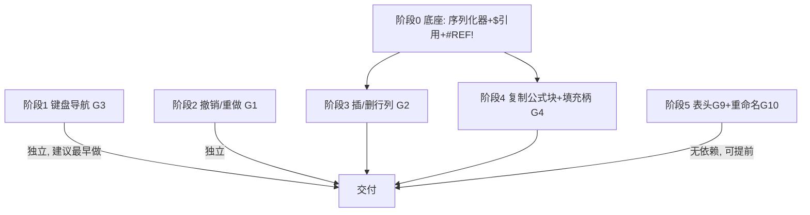

# 计算表（calc_sheet）对标 Excel 交互增强 — 可落地实施方案

> 作者：高见远（架构师）　|　输入：产品经理《计算表对标 Excel 可用性差距分析》
> 目标：在不破坏现有公式内核 / 存储 / 视觉契约的前提下，按"低成本高体感优先"顺序补齐交互层差距。
> 约束基线：存储 = `calc_sheet.content` 单 JSON 字段（version 1，整表）；cell-key `"r,c"`（0 基），`{raw,kind}`；公式原文存、引用 A1 字符串、计算值不存；编辑即存（`_recalc_fill → cs.save_content`）；DB 在 Seafile 同步范围（后写覆盖）；视觉沿用 D-Notion clean；网格 = QTableWidget。

---

## 0. 总体结论（采纳 PM 结论并细化）

1. **交互层四件事是真痛点**：无撤销(G1)、不能插行列(G2)、不能复制公式/拖填充(G4)、键盘导航不全(G3)。其中 **G3 键盘导航** 与 **G9 表头标签 / G10 重命名表** 成本最低、体感最强，优先顺手做。
2. **共同底座（阶段 0，必须先排期）**：G2 与 G4 都依赖两件事 —— ① `calc_formula.py` 缺 **AST→文本反向序列化器**；② 缺 **绝对引用 `$`** 支持（含 `$A$1 / A$1 / $A1`）。这两项做一次性成本，单列一次排期。
3. **P2 暂缓**（本期不做）：多 sheet 标签页(G5)、查找/替换(G6)、每格独立格式(G7)、冻结窗格(G8)。**每格 `fmt` 字段不入本期 content schema**（保持 version 1 不变）。
4. **撤销(G1) 范围**：仅做**会话内命令栈**（本机内存，不写库、不跨机），复用同一写回路径（`content` 逆操作 → `save_content`）。不引入跨保存/跨机版本合并。
5. **G10 `rename_sheet` 引擎已就绪**；**G9 的 `col_headers/row_headers` schema 已留、`_fill` 硬编码未渲染** —— 均"已留能力未接线"，低成本高体感。

### 0.1 content JSON 本次不改 schema

```
{"version":1, "rows":N, "cols":M,
 "cells":{"r,c":{"raw":..,"kind":..}},   # kind ∈ formula/number/text/blank；本期不增 fmt
 "params":{...},
 "col_headers":[...], "row_headers":[...]}   # G9 直接复用，不新增字段
```
撤销元数据只存**本机内存**（命令栈），不写库；不新增任何表/列。

---

## 1. 总体方案与框架选型

### 1.1 是否新增模块 / 文件

**结论：纯逻辑（序列化 / 引用重写 / 结构变换 / 命令栈）与 UI 严格分离，全部可无头单测；UI 改动集中在 `calc_sheet_view.py`。不引入任何第三方新依赖（沿用 PySide6 + 现有引擎）。**

| 文件 | 动作 | 职责 |
|------|------|------|
| `app/engine/calc_ast_render.py` | **新增** | `render(ast) -> str`：AST→文本反向序列化器；`render_cell(sheet,row0,col0,abs_row,abs_col)` 等纯函数。**阶段 0** |
| `app/engine/calc_ref_rewrite.py` | **新增** | `shift_refs(formula, axis, at, delta, insert)`、`translate_refs(formula, dr, dc)`：引用平移/重写。**阶段 0**（供 3/4 复用） |
| `app/engine/calc_undo.py` | **新增** | `Command` 协议 + `EditCellCommand`/`PasteCommand`/`StructuralCommand`/`ParamCommand` + `CommandStack`。**阶段 2** |
| `app/engine/calc_formula.py` | **修改** | `CellRef`/`RangeRef` 增加 abs 标志；tokenizer 增加 `$`/range/`#REF!` 引用 token；`_primary`/`_after_sheet` 解析为带 abs 的节点；新增 `#REF!` 伪引用节点。**阶段 0** |
| `app/engine/calc_sheet.py` | **修改** | 新增**纯函数** `insert_row/delete_row/insert_col/delete_col(content, at, delta) -> new_content`（内部调 `shift_refs` + cell-key 重映射）。`rename_sheet` 已就绪，本期仅补"重命名时重写跨表引用"。**阶段 3/5** |
| `app/ui/calc_sheet_view.py` | **修改** | 键盘导航(阶段1)、撤销接线(阶段2)、插/删行列按钮(阶段3)、Ctrl+C/X/V + 填充柄(阶段4)、表头编辑 + 重命名按钮(阶段5)。 |
| `app/ui/calc_dialogs.py` | **基本不动** | 重命名复用 `QInputDialog` + `validate_sheet_name`（在 view 内联），不改对话框；如需要可加极薄 `RenameSheetDialog`，但优先内联。 |
| `run_tests.py` | **修改** | 在 `EXPECTED_FILES` 登记 4~5 个新测试文件（否则门禁判"未登记"）。 |
| `tests/test_calc_ast_render.py` | **新增** | 序列化器：`parse→render` 闭环、`$`/range/`#REF!` 还原、最小括号。 |
| `tests/test_calc_ref_rewrite.py` | **新增** | `shift_refs`/`translate_refs`：插入扩张、删除收缩、绝对不动、跨表不平移。 |
| `tests/test_calc_undo.py` | **新增** | 命令 apply/revert 内容正确、redo 不丢。 |
| `tests/test_calc_sheet_ops.py` | **新增** | `insert/delete_row/col`：cell-key 重映射 + 公式重写 + rows/cols 计数 + headers 同步。 |
| `tests/test_calc_view_smoke.py` | **新增(可选)** | offscreen 冒烟：键盘事件、撤销按钮、插行后引用仍正确。 |

> 为何新增 3 个引擎小模块而非并入 `calc_formula.py`：序列化与重写都是**纯函数、可独立单测、且会被引擎层(test_calc_sheet_ops)与 UI 共同调用**。并入大文件会增加圈复杂度、拖慢回归。命令栈独立文件同理。

---

## 2. 数据模型与接口变更

### 2.1 content JSON（本期不改结构）

仅 G9 使用既有 `col_headers`/`row_headers`；不新增 `fmt`、不新增 undo 元数据。**version 仍为 1**。

### 2.2 `calc_formula.py` 节点与解析变更

```python
# CellRef：增加绝对引用标志
class CellRef:
    def __init__(self, sheet, row0, col0, abs_row=False, abs_col=False):
        self.sheet, self.row0, self.col0 = sheet, row0, col0
        self.abs_row, self.abs_col = abs_row, abs_col

# RangeRef：四角各自绝对标志（Excel 每角独立锚定）
class RangeRef:
    def __init__(self, sheet, r1, c1, r2, c2,
                 abs_r1=False, abs_c1=False, abs_r2=False, abs_c2=False):
        self.sheet = sheet
        self.r1, self.c1 = min(r1, r2), min(c1, c2)
        self.r2, self.c2 = max(r1, r2), max(c1, c2)
        self.abs_r1, self.abs_c1, self.abs_r2, self.abs_c2 = abs_r1, abs_c1, abs_r2, abs_c2

# 新增：删除行/列后引用失效的伪引用
class ErrRef:
    def __init__(self):
        self.token = "#REF!"
```

**tokenizer 改造**（最小侵入）：在 `_TOKEN_RE` 的 `ident` 之前插入一个 `ref` 分支：

```python
# 允许  $A$1  A$1  $A1  A1  A1:B2  $A$1:$B$2  #REF!
_TOKEN_RE = re.compile(r"""\s*(?:
    (?P<ref>\$?[A-Za-z]{1,3}\$?[0-9]{1,5}(?::\$?[A-Za-z]{1,3}\$?[0-9]{1,5})?)
  | (?P<errref>\#REF!)
  | (?P<num>\d+(?:\.\d+)?)
  | (?P<str>"[^"]*")
  | (?P<ident>[A-Za-z_\u4e00-\u9fff][A-Za-z0-9_\u4e00-\u9fff]*)
  | (?P<op><>|<=|>=|[-+*/^()<>=!,:])
)""", re.X)
```

> 说明：`A1` 形式仍会被 `ref` 命中（无 `$` 即普通相对引用）；`SUM`/`PARAM` 等因无尾随数字不会命中 `ref`（走 `ident`）。`Sheet2!A1` → `ident("Sheet2")` + `op("!")` + `ref("A1")`，与现有跨表解析路径完全兼容。

**`_primary` / `_after_sheet` 改造**：命中 `ref` 时抽出 `sheet=None or 跨表sheet`，按 `:` 拆端，逐端 `parse_ref_part`：

```python
def parse_ref_part(tok: str):
    """'$A$1' -> (abs_col, abs_row, col_letters, digits)。"""
    # 去 sheet 前缀已由调用方处理
    c_abs = tok.startswith("$"); tok = tok[lstrip $]
    # 切列字母与行数字（列字母后可能跟 $）
    m = re.match(r"^(\$?)([A-Za-z]{1,3})(\$?)([0-9]{1,5})$", tok)
    ...
```

> **`a1_to_rc` / `rc_to_a1` 保持不变**（序列化与重写均复用它们做坐标换算）。

### 2.3 新增：序列化器 `render()`（阶段 0）

```python
def render(node) -> str:
    """AST 节点 → 公式正文（不含前导 '='）。与 Parser.parse 严格互逆（见 §5 约定）。"""
    if isinstance(node, Num):
        v = node.v
        return str(int(v)) if float(v).is_integer() else repr(v)
    if isinstance(node, Str):
        return '"' + node.v.replace('"', '""') + '"'     # 引号转义（含引号字符串本期边界见 §6）
    if isinstance(node, CellRef):
        return render_cell(node.sheet, node.row0, node.col0, node.abs_row, node.abs_col)
    if isinstance(node, RangeRef):
        a = render_cell(node.sheet, node.r1, node.c1, node.abs_r1, node.abs_c1)
        b = render_cell(node.sheet, node.r2, node.c2, node.abs_r2, node.abs_c2)
        return f"{a}:{b}"
    if isinstance(node, ErrRef):
        return "#REF!"
    if isinstance(node, UnaryOp):
        op = render(node.operand)
        if isinstance(node.operand, (BinOp,)):       # 一元作用于二元时加括号
            op = f"({op})"
        return f"{'-' if node.op=='-' else '+'}{op}"
    if isinstance(node, BinOp):
        return _render_binop(node)
    if isinstance(node, FuncCall):
        return f"{node.name}(" + ",".join(render(a) for a in node.args) + ")"
    if isinstance(node, _SheetParam):
        return f"{node.sheet}!PARAM(" + ",".join(render(a) for a in node.args) + ")"
    raise ValueError("未知节点")

def render_cell(sheet, row0, col0, abs_row, abs_col) -> str:
    col = ("$" if abs_col else "") + col_to_letters(col0 + 1)
    row = ("$" if abs_row else "") + str(row0 + 1)
    return (f"{sheet}!" if sheet else "") + col + row
```

**`_render_binop`（最小括号规则，保证与 parser 优先级互逆）**：
- 优先级（低→高）：比较 `< = > <> <= >=` < `+ -` < `* /` < `^` < 一元 `-` < 原子。
- 对左/右子节点：若子节点是 `BinOp` 且其优先级 **低于** 当前，或（**同优先级且为左结合且位于右侧**），则包 `()`。
- 结果：`render(parse("1+2*3"))=="1+2*3"`、`render(parse("(1+2)*3"))=="(1+2)*3"`、`render(parse("A1-(B1+C1)"))=="A1-(B1+C1)"`。

### 2.4 新增：引用重写 `shift_refs` / `translate_refs`（阶段 0，供 3/4 复用）

```python
def shift_refs(formula: str, axis: str, at: int, delta: int, *, insert: bool) -> str:
    """插入/删除行列时改写公式内引用。
    axis: 'row'|'col'；at: 0 基插入/删除位置；delta: 受影响行/列数(>0)；
    insert=True 插入，False 删除。仅对 sheet is None 的自引用生效（跨表引用不平移）。"""
    body = formula[1:] if formula.startswith("=") else formula
    try:
        ast = Parser(body).parse()
    except ParseError:
        return formula                      # 防御：解析失败原样返回
    T = _make_shift_T(axis, at, delta, insert)
    new = _walk(ast, T)
    return "=" + render(new)

def translate_refs(formula: str, dr: int, dc: int) -> str:
    """复制/填充时按位移平移相对引用；绝对引用不动。无扩张语义。"""
    body = formula[1:] if formula.startswith("=") else formula
    try:
        ast = Parser(body).parse()
    except ParseError:
        return formula
    T = _make_translate_T(dr, dc)
    return "=" + render(_walk(ast, T))
```

**平移变换函数 `T`（核心算法，务必与 Excel 一致）** —— 对单个 CellRef 坐标 (row0,col0) 作用：

| 场景 | 行轴规则（列轴同构） | 备注 |
|------|----------------------|------|
| **插入** `insert=True` | 若 `not abs_row` 且 `row0 >= at`：`row0 += delta`；否则不变 | 插入点之上的引用不动；之下整体下移 |
| **删除** `insert=False` | 若 `not abs_row`：<br>• `at <= row0 < at+delta` → 标 `#REF!`（引用落进被删区间）<br>• `row0 >= at+delta` → `row0 -= delta`；<br>• 否则不变 | 删除点之上的引用不动；之下整体上移 |
| **复制/填充** `translate` | 若 `not abs_row`：`row0 += dr`；若 `not abs_col`：`col0 += dc` | 绝对引用两端都不动 |

**RangeRef = 两端各自独立套用同一 `T`**（这是关键简化）：
- 插入点落在区域**内部**（近端 `row0<at` 不平移、远端 `row0>=at` 平移 +delta）→ 区域**自然扩张** `delta`。
- 插入点**在区域之前**（两端都 `>=at`）→ 整片平移，无扩张。
- 删除点落在区域**内部** → 近端不动、远端 `-delta` → 区域**收缩**。
- 某端命中被删区间 → 该端变 `#REF!` 节点。

> **跨表引用不平移**：仅 `sheet is None` 的自引用套用 `T`；`Sheet2!A1` 等显式跨表引用原样保留（因为它指向别的表的网格，不受本表行列变动影响）。这与"插入只重写本表公式"的语义一致，也避免了误改跨表锚点。

### 2.5 新增：结构变换 `insert_row/delete_row/insert_col/delete_col`（阶段 3，引擎层纯函数）

```python
def insert_row(content: dict, at: int, delta: int = 1) -> dict:
    """返回新 content（不就地改）。含：cell-key 重映射 + 公式引用重写 + rows 计数 + row_headers。"""
    new = copy.deepcopy(content)
    cells = new.setdefault("cells", {})
    remapped = {}
    for key, cell in cells.items():
        r, c = (int(x) for x in key.split(","))
        if r >= at:
            r += delta
        nk = f"{r},{c}"
        if cell.get("kind") == "formula" and str(cell.get("raw", "")).startswith("="):
            cell = dict(cell, raw=shift_refs(str(cell["raw"]), "row", at, delta, insert=True))
        remapped[nk] = cell
    new["cells"] = remapped
    new["rows"] = int(content.get("rows", 0)) + delta
    _shift_headers(new, "row", at, delta, insert=True)
    return new
# delete_row/insert_col/delete_col 同构（axis 与 shift_refs 的 insert 标志对应）
```

- **cell-key 重映射**：纯机械 `r>=at → r+delta`（行）/ `c>=at → c+delta`（列），安全。
- **公式重写**：对 `kind=="formula"` 的 cell 调 `shift_refs`。
- **headers 同步**：`row_headers` 在 `at` 处插入 `delta` 个 `""`；`col_headers` 在列插入时同步；删除时 `pop`。

### 2.6 新增：命令栈 `Command` / `CommandStack`（阶段 2）

```python
class Command(Protocol):
    label: str
    def apply(self, content: dict) -> dict: ...   # 返回新 content
    def revert(self, content: dict) -> dict: ...  # 返回撤销后的 content

@dataclass
class EditCellCommand:
    key: str; before: Optional[str]; after: Optional[str]
    def apply(c):  c = _set(c, key, after); return c
    def revert(c): c = _set(c, key, before); return c

@dataclass
class PasteCommand:            # TSV 值粘贴 / 公式块粘贴 共用
    cells: List[Tuple[int,int]]; before: dict; after: dict
    def apply(c): return _patch(c, cells, after)
    def revert(c): return _patch(c, cells, before)

@dataclass
class StructuralCommand:       # 插/删 行列
    op: str; at: int; delta: int
    def apply(c): return _dispatch(c, op, at, delta)        # 调 calc_sheet.insert/delete_*
    def revert(c): return _dispatch(c, op, at, -delta)      # 撤销=反向操作（插→删，删→插）

@dataclass
class ParamCommand:
    before: dict; after: dict
    def apply(c): c["params"] = after; return c
    def revert(c): c["params"] = before; return c

class CommandStack:
    def __init__(self): self._undo = []; self._redo = []
    def push(self, cmd): self._undo.append(cmd); self._redo.clear()
    def undo(self) -> Optional[Command]: ...
    def redo(self) -> Optional[Command]: ...
    def can_undo(self) -> bool: ...
```

- 栈存活于 `CalcSheetView`（按表隔离）；`_load_sheet` 时 `stack.clear()`（会话内、不跨表）。
- 每个写操作 = 构造 command → `content = cmd.apply(content)` → `_recalc_fill()`（含 `save_content`）→ `stack.push(cmd)`。
- 撤销：`cmd = stack.undo()` → `content = cmd.revert(content)` → `_recalc_fill()`（复用同一写回路径，符合 PM"逆操作写回 content 再 save_content"）。
- **不写库、不跨机**：undo 元数据仅在此栈内（内存）。

### 2.7 与现有 `classify_cell` / `_fmt` / `CalcEvaluator` 的衔接点

- **`classify_cell`**：结构变换重写公式后 `kind` 仍为 `formula`（raw 仍以 `=` 开头），无需重算 kind；`EditCellCommand` 写入即调 `_write_cell`（内部已 `classify_cell`）。
- **`_fmt`**：显示层不变；`#REF!`/`#NAME?` 等错误值在 `_make_item` 已按 `ErrVal` 标红，新增 `#REF!` 伪引用走同一 `ErrVal(ERR_REF)` 路径。
- **`CalcEvaluator`**：`Engine._eval` 增加 `ErrRef → return ErrVal(ERR_REF)`；`cell_value` 对指向不存在行的引用已由 `raw_cell` 返回空——但 `#REF!` 伪引用是公式内部的节点，求值时直接返回 `#REF!`，无需引擎感知行列越界。
- **导出 `should_keep_formula`**：含 `#REF!` 的公式天然含 `!` → 自动判为"填值"（Excel 也无法保留），无回归。

---

## 3. 任务分解（有序、含依赖、按实现顺序）

> 阶段编号即实现顺序；依赖见 §4。每个阶段给出：目标 / 改哪些文件 / 关键函数 / 验证方式。

### 阶段 0 — 共同底座：AST 序列化器 + 绝对引用 `$`（P0 硬前置）
- **目标**：让公式能被"解析→改写→还原"闭环，支撑 G2/G4；并支持 `$A$1 / A$1 / $A1`。
- **文件**：`calc_formula.py`（abs 字段 + `$`/range/`#REF!` token + `parse_ref_part`）、`calc_ast_render.py`(新增)、`calc_ref_rewrite.py`(新增)、`tests/test_calc_ast_render.py`、`tests/test_calc_ref_rewrite.py`。
- **关键函数**：`CellRef/RangeRef`(改)、`render/render_cell/_render_binop`(新)、`shift_refs/translate_refs/_walk/_make_shift_T`(新)、`ErrRef`(新)。
- **算法要点**：§2.3 最小括号规则；§2.4 平移 `T` 表；`#REF!` 伪引用。
- **验证**：
  - 单测 `parse→render→parse` 闭环：对 ≥50 条代表性公式（`=A1+B1`、`=SUM(A1:A10)`、`=Sheet2!$A$1:B$2`、`=DATA("周","业务收入",2025,1)*PARAM("提成比例")`、`=-(A1+B1)`、`=IF(A1>=100,1,0)`）断言 `render(parse(x))` 等于其**规范形**（先定义 `canonical(x)`：去空格、统一最小括号）。
  - 单测 `shift_refs`：`=SUM(A2:A50)` 在第 10 行插入 → `=SUM(A2:A51)`（扩张）；`=$A$1+B1` 插行 → `=$A$1+B2`（绝对不动）；`=Sheet2!A1+A1` 插行 → `=Sheet2!A1+A2`（跨表不动）。
  - 单测 `translate_refs`：`=B2*C2` 右移一列 → `=C2*D2`；`=$B2` 右移 → `=$B2`（列绝对）；下移一行 → `=$B3`（行相对）。

### 阶段 1 — 键盘导航补全（G3，低成本高体感）
- **目标**：Tab/Enter 提交并移动、F2 就地编辑、Esc 取消、Home/End、Ctrl+方向跳边界、Del/Backspace 清空、Shift+方向扩展选区。解决 `AnyKeyPressed` 与 F2 冲突。
- **文件**：`calc_sheet_view.py`（`GridTable.keyPressEvent` 重写 + `CalcSheetView` 钩子）、`tests/test_calc_view_smoke.py`(可选 offscreen)。
- **关键改动**：
  - `_set_mode`：编辑触发改为 `DoubleClicked | EditKeyPressed | F2`（**移除 `AnyKeyPressed` 的强制覆盖歧义**——保留"选中态键入即覆盖"靠 `EditKeyPressed` 默认行为，F2 单独走就地编辑不清除）。
  - `GridTable.keyPressEvent`：拦截 `F2`(进入编辑、光标置末)、`Esc`(编辑中则取消编辑器，因不触发 `itemChanged` 故内容天然还原)、`Tab/Shift+Tab`(提交并左右移)、`Enter/Shift+Enter`(提交并下/上移)、`Home/End`(行首/行尾)、`Ctrl+方向`(跳数据边界，基于 `content["cells"]` 占用 + 表范围算 `jump_to_boundary`)、`Delete/Backspace`(清空 raw，**不进编辑**，调 `_write_cell(r,c,"")`)、`Shift+方向`(选区扩展，验证 QTableWidget 默认行为可用)。
  - 方向键 / `Ctrl+滚轮缩放` 保持现状。
- **验证**：offscreen 冒烟——模拟选中→F2→编辑→Esc 不落库；Del 清空后单元格消失；Tab 在编辑态提交并右移；Ctrl+↓ 跳到最后有值行。

### 阶段 2 — 撤销 / 重做（G1，会话内命令栈）
- **目标**：Ctrl+Z 撤销 / Ctrl+Y(或 Ctrl+Shift+Z) 重做；单格编辑、批量粘贴、参数、增删行列各为一条命令，存差分。
- **文件**：`calc_undo.py`(新增)、`calc_sheet_view.py`(栈接线 + Ctrl+Z/Y + 工具栏按钮)、`tests/test_calc_undo.py`。
- **关键改动**：`CalcSheetView.__init__` 建 `self.stack=CommandStack()`；`_load_sheet` 时 `self.stack.clear()`；`_write_cell/_on_params/_on_item_changed/paste_tsv` 改为"构造 command→apply→_recalc_fill→push"；`keyPressEvent` 接 Ctrl+Z/Y 调 `stack.undo()/redo()` 后对返回 command 调 `_recalc_fill`；工具栏加"撤销/重做"按钮。
- **验证**：
  - 单测：`EditCellCommand.apply/revert` 在内存 content 上前后一致；连续编辑→撤销 N 次→重做 N 次回到终态。
  - 冒烟：编辑一格→Ctrl+Z 还原 raw 且库值回退（确认走 `save_content`）。

### 阶段 3 — 插入 / 删除行、列 + 引用重写（G2，依赖阶段 0）
- **目标**：在选中位置插/删行列，引用按 §2.4 真重写（含扩张/收缩/绝对不动/跨表不动），`#REF!` 处理被删行。
- **文件**：`calc_sheet.py`(新增 `insert_row/delete_row/insert_col/delete_col` 纯函数 + 重命名时重写跨表引用)、`calc_sheet_view.py`(工具栏"插入行/删除行/插入列/删除列"按钮 + 调引擎函数 + 压 `StructuralCommand`)、`tests/test_calc_sheet_ops.py`。
- **关键函数**：`insert_row/delete_row/insert_col/delete_col(content, at, delta)`；UI 依据 `currentRow()/currentColumn()` 决定 `at`，缺省末行/末列。
- **验证**：
  - 单测：`insert_row` 后 cell-key `r>=at` 全部 +1；公式 `=A2+A5` 在第 3 行插入 → `=A2+A6`；`=SUM(A1:A3)` 在第 2 行插入 → `=SUM(A1:A4)`(扩张)；`=A$1` 列插入 → `=A$1`(绝对列不动)。`delete_row` 删第 2 行 → `=A3` 变 `=A2`；删中 `=SUM(A1:A3)` 的第 2 行 → `=SUM(A1:A2)`(收缩)；删中 `=A2` → `=#REF!`。
  - 冒烟：插行后重算值正确、导出公式引用一致。

### 阶段 4 — 复制公式块 + 填充柄（G4，依赖阶段 0）
- **目标**：Ctrl+C 复制选中区 raw（含公式）；Ctrl+V 识别"应用内公式块"→粘贴 raw 并按位移平移相对引用；填充柄做"复制式填充"（序列识别本期不做）。
- **文件**：`calc_sheet_view.py`(Ctrl+C/X/V 重写 + 填充柄绘制/拖拽)、`calc_ref_rewrite.py`(复用 `translate_refs`)、`tests/test_calc_view_smoke.py`(可选)。
- **关键改动**：
  - **Ctrl+C**：从 `content["cells"]` 取选中区 raw，写 `QApplication.clipboard().setMimeData`，带**自定义 MIME** `application/x-lawfirm-calc-cells` = JSON `{"origin":[r0,c0],"w":w,"h":h,"cells":{key:{raw,kind}}}`；同时写入 `text/plain` TSV（外部兼容）。
  - **Ctrl+X**：等同复制后清空选中区（压 `PasteCommand`，after 为空）。
  - **Ctrl+V**：若剪贴板含 `application/x-lawfirm-calc-cells` → 取 raw 按目标原点与源原点位移 `dr,dc` 调 `translate_refs` 重写每格公式 → 写 content（压 `PasteCommand`）；否则走既有 `paste_tsv`（值粘贴）。
  - **填充柄**：`GridTable.paintEvent` 在选中区右下角画小方块；`mousePressEvent` 命中手柄→进入拖拽，释放时按方向/跨度把源区复制到目标区（每格 `translate_refs` 平移）。**序列识别（1,2,3 / 1月,2月）本期不做**，仅复制式。
- **验证**：
  - 单测（纯逻辑）：`translate_refs` 已在阶段 0 覆盖；增加"块粘贴位移"用例：源 `B2*C2` 在目标 `D4` 处 → `D4*E4`。
  - 冒烟：选中公式列 Ctrl+C → 选空白列 Ctrl+V → 相对引用按列平移、绝对引用锚定；填充柄下拉复制式填充。

### 阶段 5 — 表头标签(G9) + 重命名表(G10) 顺手补（无依赖）
- **目标**：列头/行头渲染 `col_headers/row_headers`（双击表头编辑）；左栏加"重命名"入口接已就绪的 `rename_sheet`。
- **文件**：`calc_sheet_view.py`（`_fill` 改表头渲染 + 表头双击编辑 + 重命名按钮）、`calc_sheet.py`(重命名时重写所有表的跨表引用 `OldName!`→`NewName!`)、`run_tests.py`(登记新测试)。
- **关键改动**：
  - `_fill`：`setHorizontalHeaderLabels([col_headers[i] or _col_name(i) for i])`；行表头同理用 `row_headers`。
  - 表头 `sectionDoubleClicked` → `QInputDialog.getText` → 写 `content["col_headers"/"row_headers"][i]` → `_recalc_fill`（压一个轻量 `HeaderCommand` 或并入 `EditCellCommand` 思路；本期可仅做即时保存，撤销可暂缓）。
  - 左栏"重命名"按钮/`QListWidget` 右键 → `QInputDialog` + `validate_sheet_name` → `cs.rename_sheet`（同时调 `rewrite_cross_sheet_refs(old,new)` 改写全库公式中 `Old!` 前缀，防断链）。
- **验证**：冒烟——双击列头改名后表头即时更新；复制表改名；跨表引用在改名后仍能求值（不出现 `#REF!`）。

---

## 4. 依赖图



**文字依赖说明**：
- **阶段 0** 是 P1 主力（G2/G4）的硬前置，单列一次成本，最先排期。
- **G3 键盘导航（阶段 1）** 与 **G1 撤销（阶段 2）** 相互独立、不依赖阶段 0；PM 建议 G3 因成本最低优先顺手做。
- **G2 插行列（阶段 3）** 依赖阶段 0（shift_refs + abs + 序列化器）。
- **G4 复制/填充（阶段 4）** 依赖阶段 0（translate_refs + abs + 序列化器）。
- **G9/G10（阶段 5）** 无依赖（G10 引擎已就绪、G9 schema 已留），可随时插入，甚至在阶段 1 之前。

---

## 5. 共享知识 / 约定

1. **raw 文本是引用真相源**：计算值永不入库；引用以 A1 字符串存于 raw；任何重写都是"parse raw → 改写 AST → render → 写回 raw"。
2. **序列化器与 parser 严格互逆（规范形约定）**：定义 `canonical(formula)`（去首尾空格、统一最小括号），要求 `render(parse(x)) == canonical(x)`。数字按 `int 值→无小数` 规范；字符串内 `"` 转义为 `""`（含引号字符串本期边界见 §6）。
3. **绝对引用语义**：`$A$1` 行列皆固定；`A$1` 行固定列相对；`$A1` 列固定行相对。`translate_refs`/`shift_refs` 对任一轴仅当**非绝对**时平移。
4. **`shift_refs`（插/删）vs `translate_refs`（复制/填充）**：前者带"插入点扩张 / 删除点收缩 / 命中删除区间→#REF!"语义；后者纯位移、无扩张。
5. **跨表引用不随本表行列变动而平移**（`sheet is not None` 的引用原样保留）。
6. **所有写操作统一走 `_recalc_fill → cs.save_content`**（含撤销逆操作），保证"编辑即存"契约不变；撤销仅本机会话内存栈，不写库、不跨机。
7. **应用内公式块剪贴板协议**：自定义 MIME `application/x-lawfirm-calc-cells` = `{"origin":[r0,c0],"w","h","cells":{key:{raw,kind}}}`；标准 `text/plain` TSV 同步写入以兼容外部粘贴。
8. **新增测试必须登记 `run_tests.py` 的 `EXPECTED_FILES`**（否则门禁判未登记）；门禁＝各测试文件用 venv python 子进程 + `QT_QPA_PLATFORM=offscreen` 跑。
9. **改动一律 git commit 到 `dev2` 分支**（revert 优先于 reset）。

---

## 6. 风险与待明确事项

### 6.1 实现风险

| # | 风险 | 缓解 |
|---|------|------|
| R1 | **序列化器与 parser 互逆边界**：`1.0`→`1` 规范；字符串含 `"` 当前 tokenizer 不支持（`"[^"]*"` 不识转义）——`render` 虽转义 `""`，但回 parse 会被截断 | 定义 `canonical` 规范形并单测回归；含引号字符串明确**本期不支持**（与现有 tokenizer 一致，不扩大范围）；若确需，单独扩 tokenizer 的 str 规则 |
| R2 | **插入点恰在 RangeRef 近端（at==r1）**：易歧义"扩张还是平移" | 按 §2.4 规则：近端 `row0<at` 才"不平移"，`at==r1` 视为"≥at"→平移（不扩张）。在单测显式覆盖 `=SUM(A2:A10)` 在第 2 行插入→`=SUM(A3:A11)` |
| R3 | **删除精确命中的引用行**：Excel→`#REF!`；局部 `#REF!` 需 tokenizer/parser 新增伪引用 | 已在阶段 0 新增 `ErrRef`+`#REF!` token，求值返回 `#REF!`；整格引用失效统一标 `#REF!` |
| R4 | **Seafile 与撤销共存**：本机撤销无法感知另一台机器并发编辑 | 不做跨机合并；在撤销 tooltip/帮助明示"仅回滚本机会话操作"；与现有"后保存者覆盖"提示口径一致 |
| R5 | **填充柄序列识别**（1,2,3 / 1月,2月） | 本期**只做复制式填充**，序列识别列为 P2；UI 手柄拖拽仅复制式 |
| R6 | **`AnyKeyPressed` 与 F2 冲突** | 阶段 1 移除 `AnyKeyPressed` 强制歧义，改用 `EditKeyPressed|F2|DoubleClicked`；F2 单独接线（进编辑、光标末、不清除）；Esc 由编辑器默认取消（不触发 `itemChanged`） |
| R7 | **重命名表未重写跨表引用** → 其他表 `=Old!A1` 变 `#REF!` | 阶段 5 在 `rename_sheet` 后调 `rewrite_cross_sheet_refs`（全库 content 纯文本替换 `Old!`→`New!`），低成本防断链 |
| R8 | **headers 与 rows/cols 计数同步** | 结构变换同步 `row_headers/col_headers` 插入/删除，避免渲染错位 |

### 6.2 待用户拍板的 Open Questions（附推荐默认）

> 以下 8 条取自 PM gap 文件第 3 节；每条给出**推荐默认选项**供快速决策。

| # | 问题 | **推荐默认** | 理由 |
|---|------|------------|------|
| Q1 | 撤销是否只做"会话内"？ | **是，会话内命令栈，不持久化、不跨机** | 避免放大 Seafile 覆盖风险；落库即存，"保存/未保存"边界本不存在 |
| Q2 | 插/删行列做 (a) 真重写？ | **是 (a)**，排期阶段 0 底座后做 | 真重写才是"对标 Excel"；(b) 标红兜底仅作临时过渡、不建议长期 |
| Q3 | 多 sheet 标签页本期做？ | **否，P2 暂缓** | 本应用各核算表相对独立；做 tab 牵动左侧导航重构，成本中~高；出现真实"汇总表引用分表"场景再定 |
| Q4 | 相对/绝对引用 `$` 本期实现？ | **是**（G2/G4 共同前置，必须先做） | 无 `$` 则插入会把应固定的 `$A$1` 也平移，反而错 |
| Q5 | 复制公式块 / 填充柄本期做？ | **是（G4，P1）** | 高频刚需（12 个月各填一遍）；依赖阶段 0，与 G2 共享底座 |
| Q6 | 每格独立数字格式本期要？ | **否**（维持全局两位小数+千分位，§11.4） | 律所多数场景全局格式已够；差异化是加分非刚需 |
| Q7 | 键盘 `AnyKeyPressed` 覆盖手感保留？ | **保留"选中态键入即覆盖"，加 F2 就地编辑 + Esc 取消** | 兼顾 Excel overwrite 手感与 F2 理念，按 §6 R6 接线 |
| Q8 | 表头标签 / 重命名一并顺手补？ | **是**（G9/G10，低成本高体感） | 两者引擎/数据已就绪，仅差 UI 接线 |

**设计补充的待确认项（同样给出推荐默认）**：
- **Q9 删除命中引用行→`#REF!` 处理**：推荐**新增 `#REF!` 伪引用节点**（阶段 0 已设计），使 `=A1+#REF!` 能解析并求值为 `#REF!`，比"整格置错"更贴近 Excel。
- **Q10 重命名是否重写跨表引用**：推荐**是**（`rewrite_cross_sheet_refs`），低成本防止其他表断链成 `#REF!`。

---

## 附录 A — 类 / 模块结构（Mermaid classDiagram）

> 详见 `docs/calc_sheet_class.mermaid`

## 附录 B — 关键调用流（Mermaid sequenceDiagram）

> 详见 `docs/calc_sheet_sequence.mermaid`（含：插入行引用重写流、撤销逆操作流、复制公式块+填充流）
