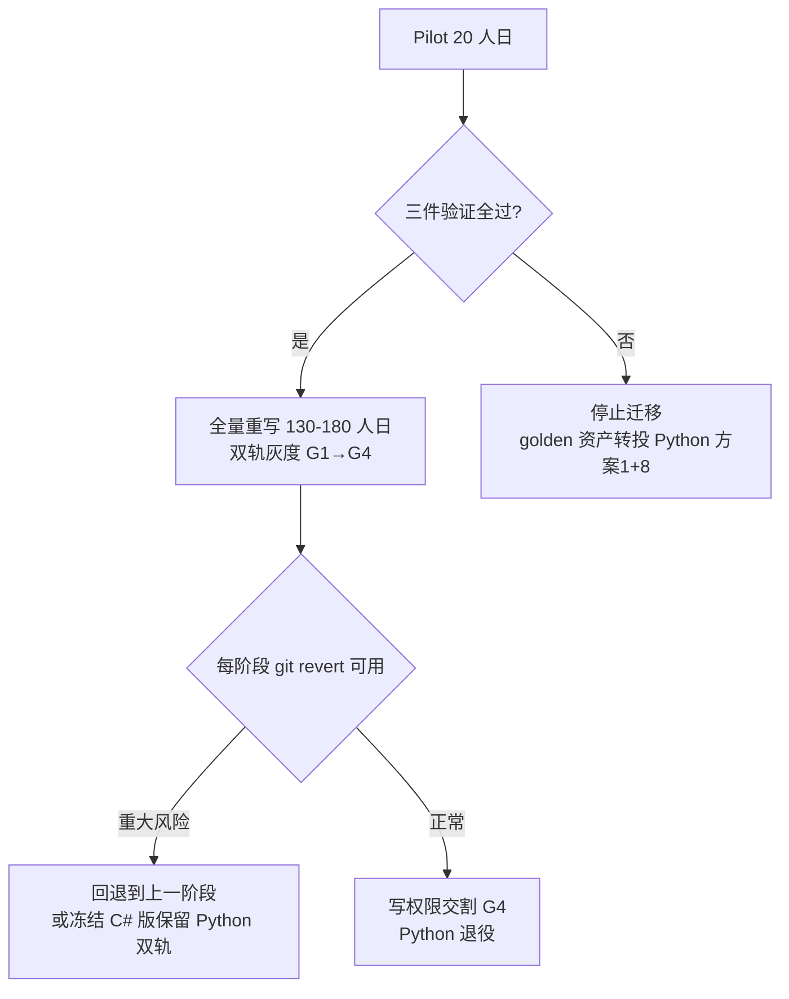
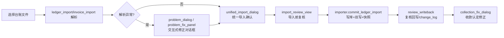
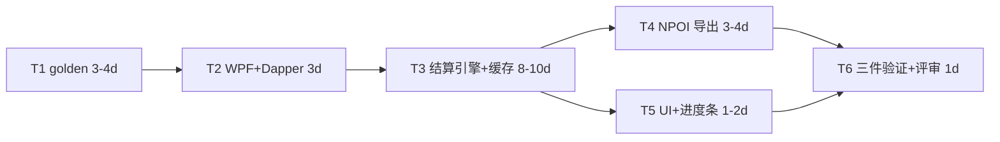
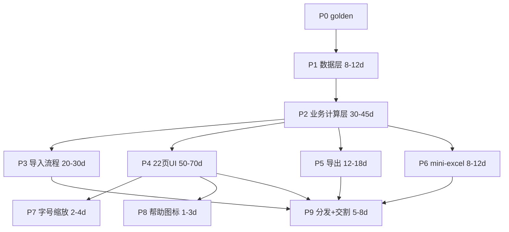

# lawfirm_app · C#/WPF 重写重构计划（详细开发文档）

> 作者：高见远（架构师）　日期：2026-09-09　性质：**待用户逐条确认的计划文档，尚未开工**
> 基线：`main` @ `90f22b1`，仓库根 `C:\Users\Bingo\Desktop\buddy2\lawfirm_app\`
> 依据文档（均已逐字研读，未凭空编造）：
> - `docs/plan4-dotnet-deep-dive-2026-09-09.md`（C#/WPF 深评）
> - `docs/final-decision-summary-2026-09-09.md`（决策汇总）
> - `docs/refactor-audit-2026-09-09.md`（代码审计 + 6 阶段重构路线）
> - `docs/tech-stack-rewrite-options-2026-09-09.md`（8 方案对比）
> - 实地源码：`app/db.py`（24 表 schema）、`app/engine/person_settlement.py`、`app/engine/refund.py`、`app/engine/calc_sheet.py`、`app/engine/calc_formula.py`、`app/engine/collection.py`、`app/ui/main_window.py` 等
>
> **决策翻转说明**：先前主线为「Python 重组（方案 1+8）」，用户现已决定**以 C#/WPF 作为主线重写目标**。本文档即据此翻转后的主线撰写。
> **硬约束**：① 仅收免费开源（MIT/Apache/BSD/GPL），任何商业授权组件一律排除（EPPlus/Xceed/Syncfusion/Telerik/Handsontable/DevExpress 等）；② 数据层第一原则 = 复用现有 `data/lawfirm.db`、**零数据风险**；③ 本文档只写计划，不修改任何源码、不创建工程骨架、不 commit。

---

## 1. 目标与范围

### 1.1 两阶段总览

| 阶段 | 目标 | 人日 | 日历（每周 1.5 天） | 通过门槛 | 失败处置 |
|---|---|---:|---|---|---|
| **Pilot（探路）** | 验证三件不确定事，拿到 go/no-go 信号 | **20 人日** | ≈ 13–19 周 | 见 1.3 三件验证全部通过 | 停止，golden 资产转投 Python 方案 1+8（零浪费） |
| **全量重写** | 完整替代 Python 版（数据层→计算层→导入→22 页 UI→导出→mini-excel→字号缩放→帮助图标） | **130–180 人日** | ≈ 1.7–2.3 年 | 见 1.4 里程碑验收 | 双轨回退 / 冻结 C# 版 |

> 关键节奏原则：**全量阶段开启后，Python 老程序必须继续并行跑到 C# 追上核心报表**（见第 9 章双轨）；每阶段 1 commit + push，回退走 `git revert`（见第 11 章）。

### 1.2 Pilot 范围（最小可验证闭环）

- 最小 WPF 骨架（net10.0-windows 单目标先启，Win7 后门推迟到全量期，见第 3 章）
- Dapper 直连现有 `data/lawfirm.db`（**只读**）
- NPOI 跑通「**个人结算总表**」导出（`person_settlement_exporter` 等价）
- UI 接近现有 Notion 风格（HandyControl，MIT）+ **异步进度条**（解决现有导出冻结问题）
- golden-file 跨语言回归（与 Python 方案 1 阶段 0 **100% 共用**，零浪费）

### 1.3 Pilot go/no-go 三件验证标准（量化通过门槛）

| # | 验证项（用户给的三件不确定事） | 量化通过门槛 | 验证方法 |
|---|---|---|---|
| **① NPOI 列名覆盖** | 现有 `.xls/.xlsx` 模板列名 **100% 可写入**，5 个导出器列名/合并/数字格式/页面设置逐格 diff **一致率 = 100%** | golden-file：C# 产物 vs Python 基准，列名序列、sheet 名、合计行、page_setup **全绿**（0 处偏差） | `scripts/diff_xlsx.py`（复用 Python openpyxl 读两侧产物逐格比对），对 5 个导出器各跑一遍 |
| **② 共享 SQLite 灰迁移不冲突** | 3 台 PC + Seafile 同步下，C# 只读打开 `lawfirm.db` 与 Python 版**并发（Python 写 + C# 读）不报 `database is locked`** | 连续 3 天、每日早中晚各一次：Python 正常导入/编辑 + C# 只读报表，WAL 下 **0 次锁冲突**；文件占用提示机制可用 | 3 台 PC 实测；`db.py:559 checkpoint()` 已在关应用前 `wal_checkpoint(TRUNCATE)` |
| **③ WPF UI 接近 Notion 风格** | 主框架（无边框窗 + 侧栏 + 表格冻结列 + 两级表头 + 列布局持久化）**视觉接近度 ≥ 80%**（对照现有 qfluentwidgets 22 页截图） | 完成「各类报表」页 1 页高保真，用户主观评分 ≥ 4/5 | 截图对比 + 用户主观确认 |

> **补充第 4 项（主观但关键，取自深评 §10.4）**：这 20 天里写 C# 的体验是否让你愿意再写 110–160 天。**任一不满足 → 停止迁移**，golden 资产转投方案 1。

### 1.4 全量阶段里程碑验收（摘要，细化见第 7 章）

- G1（只读报表）：C# 只读 4–5 个常用报表页，数值与 Python 版逐位一致
- G2（全页平移）：22 页功能对齐，含表格基础设施自研（冻结列/两级表头/筛选/列持久化）
- G3（写权限交割）：导入/编辑/导出全部由 C# 接管，Python 退役
- 全程：**零数据风险**（见第 5 章）、**性能 ≥ Python 优化后**（结算缓存治本，见第 4 章）

---

## 2. 技术栈锁定

### 2.1 锁定组合

| 层 | 选型 | 版本 | 许可证 | 角色（对应 Python 现状） |
|---|---|---|---|---|
| 运行时/UI | **WPF on .NET 10** | .NET 10 (LTS) | 随 .NET | 对应 PySide6 + qfluentwidgets |
| 数据访问 | **Dapper** + **Microsoft.Data.Sqlite** | Dapper 2.1.x / MDS 10.x | Apache 2.0 / MIT | 对应手写 `db.py`（手写 SQL 原样搬） |
| Excel | **NPOI** | 2.7.x | **Apache 2.0** | 对应 openpyxl + xlrd（单库覆盖 .xls/.xlsx/.xlsm） |
| MVVM | **CommunityToolkit.Mvvm** | 8.x | MIT | 对应现有 UI 直连逻辑（强制分层） |
| 控件/主题 | **HandyControl** | 3.x | MIT | 对应 qfluentwidgets Notion 风（80+ 控件 + 主题） |
| 日志 | **Microsoft.Extensions.Logging** + Serilog 提供器 | 8.x / 4.x | MIT / Apache 2.0 | 替代 `print` / `log.appendPlainText` |

### 2.2 为何不用 WinUI 3

| 维度 | WPF | WinUI 3 | 结论 |
|---|---|---|---|
| Win7 后门 | ✅ multi-target net48 | ❌ 门焊死（最低 Win10 1809） | WPF 保留后补票 |
| 第一方 DataGrid | ✅（2010 起零新特性，但可用） | ❌ 无；CommunityToolkit 未移植 WinUI3 | 数据密集 22 页致命缺口 |
| 表格生态（只收开源） | 内置够用 + HandyControl(MIT) | 仅社区 `WinUI.TableView`（单人维护 bus factor） | WinUI3 表格=结构性真空 |
| 用户心理门槛 | 同属微软栈，已解除 WinUI3 拒绝 | 此前已明确拒绝 WinUI3 | 降低决策阻力 |

→ **选 WPF 是唯一同时满足「Win7 后门保留 + 表格可用 + 免费开源」的栈**（深评 §3.4）。

### 2.3 为何 NPOI（11/11 全覆盖）

NPOI 是 Apache POI 的 .NET 移植，单库覆盖本项目全部 Excel 需求（深评 §5.3 逐项核对）：

| # | 导出特性 | NPOI 覆盖 | 说明 |
|---|---|:-:|---|
| 1 | 多 sheet ≤33 | ✅ | `wb.CreateSheet` |
| 2 | 合并单元格 | ✅ | `AddMergedRegion` |
| 3 | 两级表头（横向合并） | ✅ | 同 2 |
| 4 | 打印设置 orientation/fitToWidth | ✅ | `sheet.PrintSetup` |
| 5 | 页边距 | ✅ | `PrintSetup` |
| 6 | 写入真实公式 | ✅ | `SetCellFormula`（求值交给 Excel，语义与 openpyxl 一致） |
| 7 | 字体/对齐/边框/填充 | ✅ | 需 Style 池化复用 |
| 8 | 数字格式 `#,##0.00` | ✅ | `DataFormat` |
| 9 | 列宽+行高（含自适应） | ✅ | 不提供自动列宽，沿用 Python 自算逻辑 |
| 10 | 冻结窗格 | ✅ | `CreateFreezePane` |
| 11 | 自动筛选/数据校验 | ✅ | 富余能力 |

**对比 openpyxl+xlrd**：NPOI 单库即全覆盖 `.xls`(HSSF)/`.xlsx`(XSSF)/`.xlsm`，少一个依赖、少一套 API 心智；代价是 API 冗长（约为 openpyxl 的 1.5–2×，5 个导出器 ≈1,800–2,400 行）。**EPPlus 5+ 转 Polyform Noncommercial（商用需付费）—— 按约束出局**；ClosedXML(MIT) 可作备选但无 .xls 写且引入双库，不采用。

---

## 3. Win7 后门策略（待用户确认项 ⚠️）

### 3.1 方案

同一份代码 multi-target：`<TargetFrameworks>net10.0-windows;net48</TargetFrameworks>`，产出两个产物。

| 维度 | 现实代价 |
|---|---|
| C# 语言版本 | net48 默认 **LangVersion 7.3**（无 record/init/默认接口成员/range-index）；想用新语法需 `IsExternalInit` shim |
| NuGet 生态 | 只能消费 **netstandard2.0** 包 → 恰好 = Dapper + Microsoft.Data.Sqlite + NPOI（深评 §2.2）；**EF Core 5+ 出局**（目标 netstandard2.1，net48 不实现） |
| 新 API | 用不了 .NET 8+ API，需 `#if NET8_0_OR_GREATER` 隔离或 net48 侧降级实现 |
| 每版验证 | 每次发布需在 Win7 VM 回归，约 **+0.5 人日/版** |
| 安全姿态 | 在 2020 起无安全更新的 OS 上跑全员工资财务软件——**风险与「要不要 Win7」等价** |

### 3.2 维护性影响与推荐节奏

- **开发期持续税：+10~15% 摩擦**（每次想用新 API 都要想 net48 怎么办）
- **可推迟启用**：先用 `net10.0-windows` 单目标开发，等 Win7 需求真出现再加 `net48` 目标，**前提是全程遵守 netstandard2.0 包约束与 API 自律**（这就是「后补票」的真实代价：平时为还没出现的需求交税）
- 初始搭建（SDK-style csproj + 条件包引用 + `#if` 隔离层）≈ 1~2 人日

> **待确认（B 项）**：见第 12 章。推荐默认 = **Pilot 用 net10 单目标，全量期再加 net48 后门**（避免 Pilot 阶段被条件编译拖累）。

---

## 4. 现有 Python 模块 → C# 等价映射表

> 来源：`refactor-audit` 模块依赖图 + 实地源码 `app/*`。C# 项目命名空间约定：`LawFirm.{层}`。

### 4.1 模块映射总表

| # | Python 模块（职责） | C# 项目 / 命名空间 | 数据表 | UI 页（如有） | 计算/口径要点 |
|---|---|---|---|---|---|
| 1 | `db.py` 连接/建表/WAL/11段迁移 | `LawFirm.Data`（Dapper Repository + `Schema.cs` 迁移平移） | 全部 24 表 | — | 手写 SQL 原样搬 `?`→`@p`；11 段 `ALTER` 迁移 1:1 平移（保 db 文件兼容） |
| 2 | `engine/person_settlement.py` ★结算唯一真相源 | `LawFirm.Settlement` | invoice/charge_detail/collection/refund/expense_ledger/staff | settlement（各类报表） | `_compute` 74 分支口径；**24 次重复计算 → C# 内置进程内缓存治本** |
| 3 | `engine/collection.py` 收款聚合 | `LawFirm.Collection` | invoice/charge_detail/collection/refund | invoice（经办人收款）/handler_all（收款总表） | `invoice_rows`/`handler_rows`；红冲即扣、比例分摊 |
| 4 | `engine/refund.py` 退款判定 | `LawFirm.Refund` | refund/invoice/charge_detail | refund（退款） | `evaluate_red_invoices` 5 状态分桶；`confirmed_refunds` 已确认明细 |
| 5 | `engine/prepayment.py` 预收款核销 | `LawFirm.Prepayment` | prepayment/prepayment_offset | prepayment（预收款） | 已入账未开票 → 核销生成收款 |
| 6 | `engine/expense_ledger.py` 费用台账 | `LawFirm.Expense` | expense_ledger | expense_ledger（费用台账） | 按账期/经办人归属 |
| 7 | `engine/legacy_receivable.py` 应收/期初 | `LawFirm.LegacyReceivable` | invoice/collection | — | 期初应收对账 |
| 8 | `engine/split.py` 分摊算法 | `LawFirm.Split` | — | — | `allocate_receipt`/`allocate_invoice`（比例兜底分摊） |
| 9 | `engine/raw_invoice.py`/`raw_ledger.py`/`raw_salary.py` 原始镜表 | `LawFirm.Raw` | raw_invoice/raw_ledger/raw_salary | invoice_ledger/ledger_doc/salary_ledger | 1:1 镜像、可编辑、edit→change_log |
| 10 | `engine/calc_formula.py`+`calc_eval.py`+`calc_data.py`+`calc_sheet.py` ★mini-excel 引擎 | `LawFirm.Calc` | calc_sheet/calc_indicator | calc（分成计算表） | tokenizer→parser→evaluator；SUM/ROUND/IF/DATA/PARAM；跨表引用；错误值传播；**完整重译** |
| 11 | `engine/change_log.py` 修改记录 | `LawFirm.ChangeLog` | change_log | audit（审计） | 行级溯源 |
| 12 | `engine/staff_type.py` 员工类型 | `LawFirm.StaffType` | staff_type_def/staff | staff（员工管理） | 内置 合伙/聘用/兼职 禁删改名 |
| 13 | `engine/tax_declaration.py`/`tax_deduction.py` | `LawFirm.Tax` | tax_declaration/tax_deduction | tax_declaration/tax_deduction | 弹性取值 + extra_json |
| 14 | `engine/salary_summary.py` 工资汇总 | `LawFirm.Salary` | raw_salary | salary_summary | 分成报酬/工资/预发 |
| 15 | `engine/expense_cat.py` 费用分类 | `LawFirm.ExpenseCat` | expense_cat/expense_category | expense_cat | 5 类固定 |
| 16 | `engine/review_compare.py`/`review_writeback.py` 导入复核 | `LawFirm.Review` | raw_ledger/change_log | review（导入复核） | 比对引擎 + 回写 |
| 17 | `engine/import_confidence.py`/`import_fix_log.py` | `LawFirm.ImportConfidence` | — | — | 解析置信度/修正日志 |
| 18 | `engine/backfill.py`/`backfill_module.py` | `LawFirm.Backfill` | received_snapshot | — | 收款认定快照补齐 |
| 19 | `importer/importer.py` 导入主流程 | `LawFirm.Import` | import_batch/collection/charge_detail/raw_* | import（导入） | `commit_ledger_import`/`rollback_batch`/`validate` |
| 20 | `importer/ledger_import.py`/`invoice_import.py` | `LawFirm.Import.Ledger`/`Invoice` | — | — | 台账/销项解析 |
| 21 | `importer/excel_reader.py`/`xlsx_io.py` | `LawFirm.Import.Excel` | — | — | **改用 NPOI 替换 openpyxl+xlrd** |
| 22 | `importer/parse_handler.py`/`parse_remark.py`/`date_utils.py` | `LawFirm.Import.Parse` | — | — | `normalize_date` 24 分支（日期语义逐格比对！） |
| 23 | `importer/salary_import.py`/`staff_import.py`/`expense_import.py`/`deduction_import.py`/`tax_import.py` | `LawFirm.Import.*` | — | — | 各台账解析器 |
| 24 | `importer/archive_helper.py` | `LawFirm.Import.Archive` | — | — | 存档路径解析 |
| 25 | `exporter/*` 5 个导出器 | `LawFirm.Exporter` | — | 各报表页导出按钮 | **NPOI 重写，列名对齐 golden** |
| 26 | `system/snapshot.py` 快照 | `LawFirm.System.Snapshot` | snapshot | snapshot（快照） | 整库文本备份 |
| 27 | `ui/*` 42 文件 / 22 页 | `LawFirm.UI.*`（View + ViewModel） | — | **22 页全部平移** | 见 4.3 |

### 4.2 person_settlement 重点：24 次重复计算与缓存治本

- **现状**（审计 S-2/S-3）：打开「各类报表」页触发 **24 次** `build_settlement`；导出全部员工 **1+4N 次**（N=30→121 次）。根因是「调用点重复」+「`_compute` 内 7 处 N+1 + 4 处 setdefault 急切求值」。
- **C# 治本策略（与 Python 版不同：重写可一步到位）**：
  1. 起步即内置 **进程内 LRU 缓存** `SettlementCache`：键 `(year, person, person_type)`，容量上限 256；
  2. 四次字典**预加载**（collection_by_inv / charge_by_inv / staff_types / invoice_dates）一次性拉全，消除 N+1（深评 §6.5：换栈本身不消 N+1，必须照样批量化）；
  3. `setdefault` 急切求值改为 `if not contains`；
  4. **失效点清单**（导入提交/退款确认/手动补录/费用导入/问题行修正/复核回写/员工类型变更各调一次 `Invalidate`）；
  5. 提供全局开关 `CacheEnabled`（出问题时改 `false` 热修，不必 revert）。
- **收益**：调用次数 24→1、1+4N→N+1，配合缓存+预加载，报表页打开 3.6–8.4s → 亚秒级（与 Python 优化后同量级，但 C# 单次往返更便宜 2–5×）。

### 4.3 22 个 UI 页映射（取自 `main_window.py` `_page_specs`）

| # | key | Python View | C# ViewModel/View | 依赖引擎 |
|---|---|---|---|---|
| 1 | import | ImportView | ImportViewModel / ImportView | Import |
| 2 | invoice | InvoiceCollectView | InvoiceViewModel / InvoiceView | Collection |
| 3 | handler_all | HandlerCollectView | HandlerAllViewModel / HandlerAllView | Collection |
| 4 | prepayment | PrepaymentView | PrepaymentViewModel / PrepaymentView | Prepayment |
| 5 | refund | RefundView | RefundViewModel / RefundView | Refund |
| 6 | manual | ManualEntryView | ManualEntryViewModel / ManualEntryView | Settlement/Collection |
| 7 | expense_ledger | ExpenseLedgerView | ExpenseLedgerViewModel / ExpenseLedgerView | Expense |
| 8 | salary_ledger | SalaryLedgerView | SalaryLedgerViewModel / SalaryLedgerView | Raw |
| 9 | salary_summary | SalarySummaryView | SalarySummaryViewModel / SalarySummaryView | Salary |
| 10 | tax_declaration | TaxDeclarationView | TaxDeclarationViewModel / TaxDeclarationView | Tax |
| 11 | tax_deduction | TaxDeductionView | TaxDeductionViewModel / TaxDeductionView | Tax |
| 12 | settlement | SettlementView（各类报表/个人结算总表） | SettlementViewModel / SettlementView | **Settlement** |
| 13 | staff | StaffView | StaffViewModel / StaffView | StaffType |
| 14 | review | ImportReviewView | ReviewViewModel / ReviewView | Review |
| 15 | snapshot | SnapshotView | SnapshotViewModel / SnapshotView | System.Snapshot |
| 16 | batch | BatchView | BatchViewModel / BatchView | Import |
| 17 | invoice_ledger | InvoiceLedgerView | InvoiceLedgerViewModel / InvoiceLedgerView | Raw |
| 18 | ledger_doc | InvoiceLedgerDocView | LedgerDocViewModel / LedgerDocView | Raw |
| 19 | expense_cat | ExpenseCatView | ExpenseCatViewModel / ExpenseCatView | ExpenseCat |
| 20 | data_clear | DataClearView | DataClearViewModel / DataClearView | Data |
| 21 | audit | AuditView | AuditViewModel / AuditView | ChangeLog |
| 22 | calc | CalcSheetView（分成计算表） | CalcViewModel / CalcSheetView | **Calc** |

> 4 本源台账对应关系：开票台账=invoice_ledger(raw_ledger sheet1-3)、收款/累计台账=ledger_doc(raw_ledger sheet4)、费用台账=expense_ledger、员工清单=staff/salary_ledger。

### 4.4 交互式导入修正流程（解析失败→修正对话框）

现有链路（需完整平移到 C#）：

> 关键坐标：`unified_import_dialog.py`(800 行)、`problem_dialog.py`/`problem_fix_panel.py`（各 170 行重复校验，C# 合并到 `ImportValidator`）、`review_compare.py`(293)/`review_writeback.py`(239)、`collection_fix_dialog.py`。

### 4.5 calc_sheet mini-excel 引擎（分成计算）

- `calc_formula.py`：tokenizer → 递归下降 parser（AST）→ evaluator；运算符 `+ - * / ^ ()` 一元负、比较 `= <> < > <= >=`；函数 `SUM/ROUND/AVERAGE/IF/MIN/MAX/ABS/DATA/PARAM`；引用 `A1`、`A1:B10`、跨表 `Sheet2!A1`；Excel 语义（空格=0、IF 惰性、ROUND half-up）；错误值 `#REF!/#NAME?/#CIRC!/#VALUE!/#DIV/0!/#ERROR!`；**请求级缓存 + 栈式环检测**。
- `calc_data.py`：B 层 `CalcData`（接入业务主表取数，如 `DATA($职工,"业务收入",$年,$月)`）。
- `calc_sheet.py`：A 层整表 JSON 存取（CRUD、克隆、命名校验），**只读不回写业务主表**。
- `calc_export.py`：写出真实 Excel 公式（`=A1+B1`、`=SUM(...)`，含「是否保留公式」判定）。
- **C# 重译要点**：`decimal` + `ROUND_HALF_UP` 与 Python `Decimal` 半舍入语义精确对齐；AST 节点类显式声明；公式求值引擎必须进 golden（跨语言比对同一网格计算结果）。

### 4.6 退款分桶聚合

- `refund.py.evaluate_red_invoices` 输出 **5 个状态桶**：`no_orig` / `orig_missing` / `same_month` / `orig_uncollected` / `need_refund`（需求 2.9 口径）。
- 结算侧退款分摊（二④⑤）：按红字发票经办人**比例分摊**，归入「退本年/退上年」（负）。
- **导出侧**：退款按年分桶（团队 lead 第 7 章要求「退款按年分桶」）——C# `RefundExporter` 按 `refund_date` 年维度聚合，与现有逐票明细导出区分。

---

## 5. 数据层设计（共享 SQLite 灰迁移）

> **第一原则**：复用现有 `data/lawfirm.db`，**零数据风险**。C# 不新建库、不 EF 迁移（避免 `__EFMigrationsHistory` 脏状态），手写迁移逻辑 1:1 平移。

### 5.1 schema 兼容性核对清单（逐表字段比对）

C# 只读期不碰 schema；写期必须平移 11 段 `ALTER`（`db.py:431-470`）。核对要点：

| 表 | 现有字段（节选） | C# 侧动作 |
|---|---|---|
| invoice | invoice_no, invoice_date, buyer, total_amount, kind, status, voucher_no, …, orig_invoice_no, case_no, source, import_batch_id, **src_sheet, src_row** | 字段名 1:1 映射；Dapper 实体属性 PascalCase 映射 snake_case 列 |
| charge_detail | id, invoice_no, person_name, billing_amount, source, import_batch_id, **person_type, received_override, src_sheet, src_row** | 同左 |
| collection | id, invoice_no, amount, receipt_date, person_name, source, import_batch_id, note | 同左 |
| refund | red_invoice_no, orig_invoice_no, refund_amount, refund_date, note | 同左 |
| expense_ledger | period, actual_handler, expense_type, expense_amount, …, **person_type, import_batch_id** | 同左 |
| prepayment / prepayment_offset | （见 4.1 #5） | 同左 |
| staff / staff_type_def | name, staff_type, is_active, …, **hire_month** | 同左 |
| raw_invoice / raw_ledger / raw_salary | 镜表（含 sheet_key/row_no/各类 raw 列） | 同左 |
| calc_sheet / calc_indicator | content(JSON 整表) / definition(公式) | JSON 反序列化为 C# 对象 |
| tax_declaration / tax_deduction | 弹性列 + extra_json | extra_json 用 `Dictionary<string,object>` |
| import_batch / import_log / received_snapshot / change_log / anomaly_note / expense_cat / expense_category / snapshot | — | 同左 |

> **核对方法**：写一个小脚本读 `PRAGMA table_info(<tbl>)` 两侧（Python 现库 vs C# 打开同一文件）对比列名/类型，CI 入回归。
> **日期语义红线**：`date_utils.py:58` 用 `openpyxl.utils.datetime.from_excel` 处理 1900/1904 系统 + 闰年 bug（深评 §5.4）。NPOI 读 `.xls` 走 HSSF 日期体系，**必须逐格比对**，进 golden。

### 5.2 WAL 安全

- WAL 是**数据库文件持久属性**（`db.py:422` 已设 `PRAGMA journal_mode=WAL` 写入文件头）。C# 打开同一文件即继承，**无需重设**。
- C# 连接打开时补 `PRAGMA foreign_keys=ON`（`db.py:421`，每连接非持久）。
- 关闭前 `PRAGMA wal_checkpoint(TRUNCATE)`（`db.py:559`，Seafile 场景必需——保证 db 为单一文件再同步）。
- **只读期纪律**：C# 全程 `PRAGMA query_only=ON` + 不开写事务，杜绝误写污染 Python 版数据。

### 5.3 Seafile 多机冲突规避（3 台 PC）

| 风险 | 规避 |
|---|---|
| 文件占用 / 锁定 | C# 打开 db 前检测 `-wal/-shm` 存在；若 Python 版正在写，弹「文件占用提示」，**操作前确认**（用户确认再继续） |
| 双写冲突 | 灰迁移期**任一时刻仅一个应用有写权限**：G1-G2 C# 纯只读，G3 起 Python 只做导入（见 1.1 双轨） |
| 覆盖写风险 | 任何「导出/覆盖」操作前显式确认弹窗（列明目标路径与影响范围） |
| bin/obj 进同步 | `.gitignore` 排除 `bin/`、`obj/`、`obj/`；NuGet 缓存 `%USERPROFILE%\.nuget` 天然不进 Seafile |
| 历史教训 | 此前 Seafile 干扰 `git checkout` 清空整棵 `app/`（审计 §6.1）→ 开发基线已迁出 Seafile；**Seafile 目录禁止任何 git 写操作** |

---

## 6. Pilot 详细任务分解（20 人日）

> 范围 = 最小 WPF 骨架 + Dapper 读 db + NPOI 跑通「个人结算总表」+ UI 接近 Notion + 异步进度条。

| 任务 | 人日 | C# 文件/类 | 依赖 | 产出与验证 |
|---|---:|---|---|---|
| **T1 golden 安全网** | 3–4 | `LawFirm.Tests/`（xUnit）、`scripts/diff_xlsx.py`、5 个导出器 golden JSON | 无（最先） | Python 侧 5 类导出基准 + 逐格 diff 脚本；**故意改坏口径/列名测试必红**（与方案 1 阶段 0 共用） |
| **T2 WPF 空壳 + Dapper 直连 db（只读）** | 3 | `LawFirm.App`(net10)、`LawFirm.Data/DbConnection.cs`、`InvoiceRepo.cs`、`CollectionRepo.cs` | T1 | 读出 invoice/collection 行数与 Python 版一致；SQL 计数 + 抽样数值比对 |
| **T3 移植 person_settlement + 缓存** | 8–10 | `LawFirm.Settlement/SettlementEngine.cs`、`SettlementCache.cs` | T2 | 用 Python 输出做 golden diff（JSON 序列化对比 12月×11键）；**逐位一致 + 缓存命中** |
| **T4 NPOI 重写 person_settlement_exporter** | 3–4 | `LawFirm.Exporter/PersonSettlementExporter.cs` | T3 | C# 产物 vs Python 基准**逐格 diff**（列名/合并/格式/page_setup 全绿） |
| **T5 Notion 风 UI 骨架 + 异步进度条** | 1–2 | `LawFirm.UI/SettlementView.xaml(+cs)`、`ProgressWindow.cs`、HandyControl 主题 | T3,T4 | 「各类报表」页 1 页高保真 ≥80% 接近；导出期间窗口可拖动 |
| **T6 三件验证实测 + go/no-go 评审** | 1 | 实测报告 | T1–T5 | ① NPOI 列名 100% ② 3 台 PC 3 天 0 锁冲突 ③ 用户主观 ≥4/5 → 出 go/no-go 结论 |

**人日合计 ≈ 19–24（收口 20）**。实现顺序：T1→T2→T3→T4→T5→T6（严格串行，前一步是后一步的验证基线）。

---

## 7. 全量任务分解（实现顺序 + 依赖 + 分阶段）

> 单人每周 1.5 天 ≈ 1.7–2.3 年；每阶段 1 commit + push；依赖箭头表示前置。

| 阶段 | 内容 | 关键 C# 交付 | 依赖 | 人日 |
|---|---|---|---|---:|
| **P0** | golden 安全网（Python 侧先行，已在 Pilot T1 建） | 跨语言回归基线 | — | （Pilot 已含） |
| **P1 数据层** | `LawFirm.Data` 全量 Repository + 11 段迁移平移 + WAL/只读封装 | 24 表 Dapper 实体 + 迁移 | P0 | 8–12 |
| **P2 业务计算层** | Settlement/Collection/Refund/Prepayment/Expense/Split/LegacyReceivable **含缓存治本** | 全部 engine 平移 + `SettlementCache` | P1 | 30–45 |
| **P3 导入流程** | 6 类解析器 + `ImportValidator`（合并 170 行重复）+ 交互式修正对话框 + 导入复核回写 | `LawFirm.Import.*` + `ImportValidator` | P2 | 20–30 |
| **P4 22 页 UI** | 22 页 ViewModel/View + 表格基础设施自研（冻结列/两级表头/列持久化/多选筛选） | `LawFirm.UI.*` + `TableInfra` | P2 | 50–70 |
| **P5 导出** | 5 个 NPOI 导出器（销项导出表含凭证号 / **退款按年分桶**） | `LawFirm.Exporter.*` + golden 全绿 | P2 | 12–18 |
| **P6 mini-excel 引擎** | calc_formula/eval/data/sheet 完整重译 + 分成计算表 UI | `LawFirm.Calc.*` + `CalcSheetView` | P2 | 8–12 |
| **P7 全局字号缩放（5 档）** | 继承 `Scale`（被 14 个 UI 模块依赖）的 C# 等价 | `FontScaleService` | P4 | 2–4 |
| **P8 帮助图标「?」** | 22 页「?」气泡（wt-dev 分支资产平移） | `HelpIcon` 行为 | P4 | 1–3 |
| **P9 分发 + 写权限交割** | self-contained 打包 + 双轨 G3→G4 + Python 退役 | 单机目录 + 交割脚本 | P4–P6 | 5–8 |
| **合计** | | | | **136–202（收口 130–180）** |

> **双轨灰度节点**：P4 完成常用 4–5 页后进入 G1（C# 只读报表，Python 全功能）；P5/P6 完成后 G2→G3（Python 收窄为只导入）；P9 完成 G4（Python 退役）。**任一阶段回退 = `git revert` 到上一可运行态**（第 11 章）。

---

## 8. 依赖包清单（NuGet，仅免费开源）

| 包 | 版本 | 许可证 | 用途 | 商业替代品（已排除） |
|---|---|---|---|---|
| `Microsoft.Data.Sqlite` | 10.x | MIT | SQLite ADO.NET（net48/net10 兼容） | — |
| `Dapper` | 2.1.x | Apache 2.0 | 微 ORM，手写 SQL 原样搬 | — |
| `NPOI` | 2.7.x | **Apache 2.0** | Excel .xls/.xlsx/.xlsm 读写 | EPPlus(Polyform 商用付费)❌ |
| `CommunityToolkit.Mvvm` | 8.x | MIT | MVVM（ObservableObject/RelayCommand） | — |
| `HandyControl` | 3.x | MIT | WPF 控件 + 主题（Notion 风 DataGridEx） | Xceed❌ / Syncfusion❌ / Telerik❌ |
| `Microsoft.Extensions.Logging` + `Serilog` + `Serilog.Sinks.File` | 8.x / 4.x | MIT / Apache 2.0 | 结构化日志（替代 print） | — |
| `Microsoft.Extensions.DependencyInjection` | 8.x | MIT | 依赖注入（解耦 db↔importer 循环） | — |
| `xunit` + `xunit.runner.visualstudio` + `Microsoft.NET.Test.Sdk` | 2.9.x | MIT / Apache 2.0 | 单元测试（重建 3,911 行测试） | — |
| `NSubstitute`（可选） | 5.x | BSD-3 | Mock | — |
| `ClosedXML`（可选备选） | 0.10x | MIT | 仅 xlsx 写出（不采用，NPOI 已覆盖） | — |

> **许可证硬红线**：任何商业授权（EPPlus/Xceed/Syncfusion/Telerik/Handsontable/DevExpress/QuestPDF 商业版）一律排除。HandyControl 与 CommunityToolkit.Mvvm 均为 MIT，可安全使用。

---

## 9. 分支与协作策略

| 策略 | 做法 |
|---|---|
| **新分支** | `pilot/dotnet`（Pilot 20 人日）、全量期 `feature/dotnet-*` 按阶段开 |
| **保留不动** | `wt-dev` / `wt-plan-a` / `wt-plan-b` / `wt-plan-c` / `main` **五分支原样保留**（与 C# 工作零文件重叠——C# 在 `LawFirm.*` 新项目，Python 在 `app/*`） |
| **双轨并行** | Python 老程序继续跑到 C# 追上核心报表（G1 前 Python 全功能，G3 前 Python 仍管导入）；**业务演进（退款/分成/字号缩放）先落 Python 版**，避免 C# 需求基线被冲垮 |
| **confirm-per-batch** | 每个导入批次、每次覆盖写操作**显式确认**（列明影响范围） |
| **回退纪律** | `git revert <sha>` **优先于** `git reset --hard`（审计 §6.1 教训：Seafile 曾因 checkout 清空整棵 `app/`） |
| **多机纪律** | 重构期只在一台机器改代码；其余机器只 `pull` 已 push 的 commit |
| **WAL 收尾** | 每次操作文件前关应用 + `wal_checkpoint(TRUNCATE)`，确保 db 单文件再进 Seafile |

---

## 10. 分发方案

| 方式 | 体积 | 3 台 PC（Seafile）分发 | 判定 |
|---|---|---|---|
| **self-contained 单机目录（推荐 ⚠️待确认 F 项）** | ~70–150 MB | 无需装 Runtime，**单目录拷走即用**；直接放 Seafile 同步目录（exe 为少量大文件，Seafile 友好） | 推荐 |
| framework-dependent + 装 .NET 10 Desktop Runtime | 应用 ~10–30 MB + 每台 Runtime ~55 MB（一次性） | 每台需装 Runtime | 备选（3 台固定机可接受） |
| MSIX 安装包 | — | 对内部 3 台 PC 过度工程 | 不采用 |

> **对比现状**：PyInstaller 包 100–300 MB / 启动 1–3 秒 → .NET self-contained 约 70–150 MB / 冷启动 0.3–1 秒。体积与启动确有改善但非量级差异（深评 §4.2）。
> **待确认（F 项）**：green 目录经 Seafile 同步分发 vs 独立安装包。推荐默认 = self-contained 绿色目录（与现有 Seafile 习惯一致、回退最简）。

---

## 11. 风险与回退

| 风险 | 等级 | 缓解 / 回退 |
|---|---|---|
| **Seafile 冲突** | 中 | 只读期 `query_only`；双写纪律（G1-G2 C# 只读）；bin/obj 排除；操作前文件占用提示 + 确认（第 5.3 章） |
| **灰迁移安全** | 中 | 复用同 db 文件 + 手写迁移 1:1 平移；PRAGMA 补 foreign_keys；只读期不写；schema 逐表核对进 CI |
| **Pilot 失败** | — | **回退到 Python 方案 1+8**（保留该路径，golden 资产零浪费）；不强行全量 |
| **覆盖写风险** | 中 | 任何覆盖/导出/导入前显式确认弹窗；保留 `snapshot` 整库文本备份，随时回滚 |
| **N+1 不会因换栈消失** | 高（认知） | C# 起步即字典预加载 + 缓存治本（第 4.2 章），不抱「换语言自动快」幻想 |
| **学习曲线** | 中 | XAML/MVVM 最陡（1–2 月）；Pilot 期即暴露体验问题，go/no-go 第 4 项主观判据兜底 |
| **长期双轨** | 高 | 灰度窗口 ≤3 个月；业务演进先落 Python 版；P0/P1/P2 与方案 1 优化共存 |
| **每步 commit+push** | — | 每阶段 1 commit + push；`git revert` 优先于 reset；阶段边界必须落在完整可运行状态 |

---

## 12. 待用户确认决策清单

| # | 决策点 | 推荐默认 | 理由 |
|---|---|---|---|
| **A** | 是否按本文档启动 Pilot（20 人日）？ | **是** | 三件不确定事先探路，成本可控、失败零浪费 |
| **B ⚠️** | **Win7 后门**（multi-target net48+net10）？ | **Pilot 用 net10 单目标；全量期再加 net48** | 避免 Pilot 被条件编译拖累；net48 持续税 +10–15%、每版 +0.5 人日回归；且在无安全更新的 OS 跑财务软件本身有风险 |
| **C** | 缓存策略（治本） | **C# 起步即内置进程内缓存 + 全局开关** | 重写可一步到位，避免 Python 版的 24 次重复调用顽疾 |
| **D** | **双轨并行**（Python 老程序跑到 C# 追上核心报表）？ | **是** | 业务不能停；灰度 G1→G4 低风险切换；避免重写期业务冻结 |
| **E** | 导入/覆盖写确认机制 | **全部显式 confirm-per-batch** | Seafile 历史清空 `app/` 教训；零数据风险第一原则 |
| **F ⚠️** | **分发方式**（self-contained 绿目录 vs 安装包）？ | **self-contained 绿色目录经 Seafile 同步** | 与现有习惯一致、回退最简、Seafile 友好（少量大文件） |
| **G** | 控件库（Notion 风） | **HandyControl(MIT)** | 免费开源、80+ 控件、三套主题；替代 qfluentwidgets 视觉基线 |
| **H** | 测试框架重建 | **xUnit + NSubstitute**（MIT/Apache/BSD） | 重建 3,911 行测试；许可证全免费 |
| **I** | 4 个 wt-* 分支处置 | **保留不动** | C# 在新项目，零文件重叠；其信息架构决策（页头/tab）平移到 WPF 视觉规范 |
| **J** | 历史事故代码（Seafile 清空）的防护 | **开发基线迁出 Seafile + 目录禁 git 写** | 已做（审计 §6.1 S-1/S-2），保持 |

> **开放项优先级**：B（Win7 后门）、D（双轨）、F（分发）为带 ⚠️ 的硬开放决策，需用户拍板后开工；其余 A/C/E/G/H/I/J 给出推荐默认，用户可一键确认。

---

### 附录：关键坐标速查（便于后续编码定位）

- 结算上帝函数：`app/engine/person_settlement.py:111-353`（`_compute`，74 分支）
- 结算 N+1：`person_settlement.py:160-172,150-158,241-244,250,271,274,286,289`；setdefault 急切求值 `:199,217,256,297`
- 24 次重复调用：`settlement_view.py:146,159,534,556,680,829` + `showEvent:195`
- 退款分桶：`app/engine/refund.py:19-72`（`evaluate_red_invoices`）
- mini-excel：`app/engine/calc_formula.py`（tokenizer→parser→evaluator）、`calc_sheet.py`（JSON 整表 CRUD）
- 交互式修正：`unified_import_dialog.py`(800)、`problem_dialog.py`/`problem_fix_panel.py`(各 170 重复)、`review_compare.py`(293)/`review_writeback.py`(239)
- 数据库 24 表 schema：`app/db.py:11-413`；11 段迁移 `:431-470`；WAL `:422,559`
- 22 页注册：`app/ui/main_window.py:198-221`

---

## 13. 决策确认记录（2026-09-09 用户拍板）

用户于 2026-09-09 就第 12 章逐项拍板，结果如下。除 D、I 外均与推荐默认一致。

| # | 决策点 | 用户拍板 |
|---|---|---|
| A | 启动 Pilot（20 人日） | ✅ 是 |
| B | Win7 后门 | 按推荐：Pilot 用 net10 单目标；全量期再加 net48 multi-target |
| C | 缓存策略（治本） | ✅ C# 起步即内置进程内缓存 + 全局开关 `CacheEnabled` |
| D ⚠️ | 双轨并行 | ❌ 不双轨，**业务暂停**：重写期 Python 版不再并行运行，C# 直接接管数据写权限；Python 应用保留可运行以备 Pilot 失败回退 |
| E | 导入/覆盖写确认 | ✅ 全部显式 confirm-per-batch |
| F ⚠️ | 分发方式 | 按推荐：self-contained 绿色目录经 Seafile 同步 |
| G | 控件库 | ✅ HandyControl(MIT) |
| H | 测试框架 | ✅ xUnit + NSubstitute |
| I ⚠️ | wt-* 分支处置 | ❌ 4 个 wt-* 分支（wt-dev / wt-plan-a / wt-plan-b / wt-plan-c）不再需要，删除；`main` 保留。执行：先打 `archive/wt-*` 标签再删，保留回退路径 |
| J | Seafile 防护 | ✅ 开发基线迁出 Seafile + 目录禁 git 写，保持 |

### 对原稿的覆盖说明
- **D 推翻第 1 章、第 9 章的「双轨灰度 G1→G4」表述** → 改为**单轨直接切换**：业务暂停期间 C# 可在 Pilot 验证后即获写权限，无需等 Python 并行收敛。但 Pilot T2–T4 只读期仍遵守 `query_only` 数据零风险纪律。
- **I 推翻第 9 章「保留 5 分支原样」** → 改为删除 4 个 wt-* 实验分支（其 UI 变体决策已无复用价值，C#/WPF 视觉规范另起）。`main` 与 `pilot/dotnet` 不受影响。

### 状态
- 计划：**已确认（含上述修改）**，进入 Pilot 执行。
- 分支：`pilot/dotnet` 已建（基于 main @ 90f22b1）。
- 下一步：工程师执行 Pilot T1（golden 安全网）。
