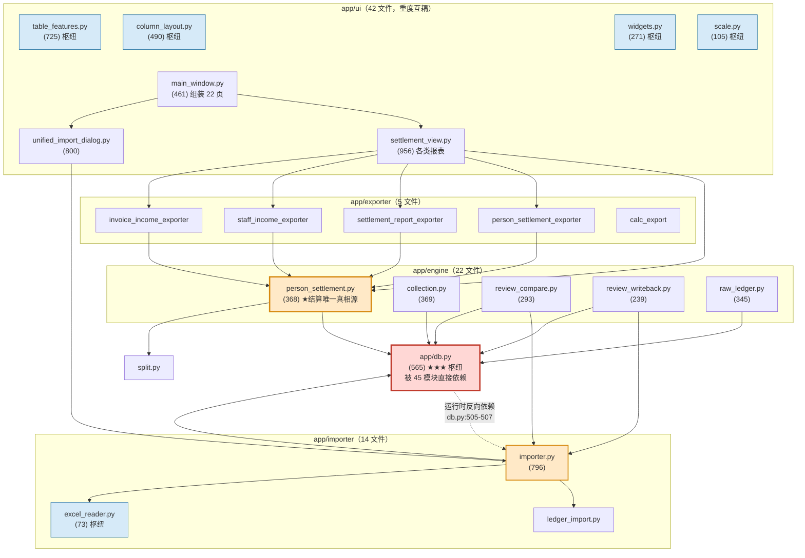
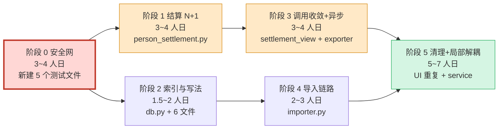

# lawfirm_app 代码审计与重构路线图

> 审计对象：`C:\Users\Bingo\Desktop\buddy2\lawfirm_app`（干净 clone，不在 Seafile 同步目录下）
> 基线：分支 `main`，HEAD `90f22b1`（2026-09-04）
> 审计日期：2026-09-09　审计人：高见远（架构师）
> 性质：**纯只读静态审计**。未修改任何源码，未执行任何 git 写操作，未运行 GUI。

---

## 0. 结论先行（TL;DR）

| 项 | 结论 |
|---|---|
| **现状核心问题 Top 3** | ① `person_settlement._compute()` 是「结算聚合的唯一真相源」，内含 **7 处 N+1 查询**，却被 UI/导出器**重复调用 4~24 次/次操作**；② `app/db.py` 被 45 个模块直接依赖，且**反向依赖** `app.importer`（循环依赖），UI 层有 12 个文件直接 `get_conn()`；③ 测试集中在「分成计算引擎」，**结算引擎、收款聚合、导入器、5 个导出器零单测**，导出列名对齐零保护 |
| **最大性能痛点** | 「各类报表」页首次打开 ≈ 触发 **24 次全量结算计算**；「导出全部员工」对 N 人触发 **1+4N 次**（30 人 = 121 次） |
| **5 套路线一句话** | A 保守清理（零行为变更）／B 分层解耦（service+repository）／C 热点优先（只治 Top-N 瓶颈）／D 领域建模（抽领域+结算引擎）／E 大爆炸重写（**不建议**） |
| **推荐** | **「0 安全网 → C 热点 → A 清理 → 局部 B」组合**，共 6 阶段、约 20~28 人日，每阶段独立 commit / 独立回退 |
| **与 4 个 wt-* UI 分支的关系** | 前 4 个阶段**只动 `app/db.py`、`app/engine/*`、`app/importer/*`、`app/exporter/*`、`tests/`**，与 4 个分支（改动域均在 `app/ui/*`）**零文件重叠**；UI 侧重构推迟到 UI 方案选定合并后 |
| **必须先拍板** | 是否接受把 `data/lawfirm.db` 从 Seafile 副本拷到新基线、是否允许引入 pytest/ruff/mypy、4 个 wt-* 分支的处置顺序（详见第 7 节） |

---

## 1. 审计基线与方法

### 1.1 规模实测（本次实测，非沿用旧数字）

| 区域 | 文件数 | 行数 |
|---|---:|---:|
| `app/`（含 2 个 `__init__.py`） | 77 | 21,489 |
| `main.py` | 1 | 34 |
| **生产代码合计** | **78** | **21,523** |
| `tests/` | 23 | 3,911 |
| `scripts/` | 2 | ≈120 |

> 说明：行数为逐文件实测（`^` 行匹配计数）。与先前基于 Seafile 旧副本（HEAD `cb068b2`）的 84 文件 / 22,903 行**不可比**——旧副本落后一整轮 `build_exe` 改造，本基线新增了「导入复核」整条链路。

### 1.2 本基线相对旧副本的增量（说明为什么必须在 `90f22b1` 上做）

| 新增/显著变化 | 行数 | 说明 |
|---|---:|---|
| `app/ui/unified_import_dialog.py` | 627 → **800** | 统一导入确认对话框 |
| `app/ui/calc_sheet_view.py` | 526 → **759** | 分成计算表 |
| `app/engine/review_compare.py` | **293**（新） | 导入复核·比对引擎 |
| `app/ui/review_post_view.py` | **517**（新） | 导入复核·事后复核页 |
| `app/engine/review_writeback.py` | **239**（新） | 复核回写 |
| `app/ui/import_review_view.py` | **175**（新） | 导入前复核 |
| `app/engine/import_fix_log.py` | **133**（新） | 修正日志 |
| `app/ui/scale.py` | **105**（新） | 字体缩放（被 14 个 UI 模块依赖） |
| `app/ui/main_window.py` | 391 → **461** | **已实现页面惰性构造**（见 3.4） |
| `app/db.py` | 553 → **565** | `init_db(backfill=False)` + `run_received_snapshot_backfill()` |

✅ **用户关心的历史问题结论**：旧 Seafile 副本 HEAD `cb068b2` **存在于 GitHub 历史中**（可由 `git log --all --oneline | findstr cb068b2` 验证），那 3 个"未推送提交"的内容已包含在 `90f22b1` 的祖先链里，**不需要抢救旧副本**。旧副本可以安全归档或删除。

### 1.3 方法

- 逐文件读取 `app/db.py`、`app/engine/person_settlement.py`、`app/engine/collection.py`、`app/importer/importer.py`、`app/ui/settlement_view.py`、`app/ui/main_window.py`、`app/ui/table_features.py`、`app/ui/unified_import_dialog.py`（节选）等 20+ 关键文件
- 全量 `import` 图扫描（正则 + 人工汇总入度）
- 全量 grep 统计：SQL 拼接点、`strftime/substr` 索引杀手、宽泛 `except`、重复 QSS/重复方法
- -shell/Python 执行环境在审计中途失效（无 stdout），故**未**执行 AST 圈复杂度脚本；复杂度改用「函数定义行号区间跨度」人工核算，报告中标注为「跨度」而非精确圈复杂度

---

## 2. 现状画像

### 2.1 模块依赖关系图



**枢纽模块（入度 Top）**

| 模块 | 入度 | 性质 | 风险 |
|---|---:|---|---|
| `app.db` | **45** | 数据访问 | 全项目最大扇入；**唯一的 schema 迁移 + 连接管理 + 快照回填**三合一 |
| `app.ui.widgets` | 25 | UI 基础件 | 尚可 |
| `app.ui.table_features` | 20 | UI 表格增强 | 尚可（已集中，是正面范例） |
| `app.ui.column_layout` | 17 | 列布局 | 尚可 |
| `app.ui.scale` | 15 | 字体缩放 | **新增即成枢纽**，且被 `style.py` 反向依赖（`style.py:18`） |
| `app.importer.excel_reader` | 13 | Excel 读取 | 尚可 |
| `app.engine.change_log` | 10 | 变更日志 | 尚可 |
| `app.engine.person_settlement` | 6 | **业务枢纽** | ⚠ 最复杂、最慢、无单测 |

### 2.2 架构层级的三处硬伤

| # | 问题 | 证据 | 后果 |
|---|---|---|---|
| 1 | **循环依赖：底层 db 反向依赖上层 importer** | `app/db.py:505-507`（`_backfill_received_snapshot` 内 `from app.importer.archive_helper/... `） | 分层形同虚设；任何 importer 改动都可能影响启动；无法对 `db.py` 单独做单测（导入即拉起 importer → 拉起 openpyxl/xlrd） |
| 2 | **engine 反向依赖 importer，且 import 私有函数** | `app/engine/review_writeback.py:18`（`from app.importer.importer import _write_collection_for_invoice`）、`:182`（`_raw_cell`）、`app/engine/review_compare.py:20`（`compute_expected_receipts`） | 下划线私有API 跨模块调用；改动 importer 会静默打断复核链路 |
| 3 | **UI 层直接写 SQL** | 12 个 `app/ui/*` 文件直接 `get_conn()`：`calc_dialogs.py`(12处)、`import_verify_view.py`(8)、`staff_view.py`(7)、`import_view.py`(6)、`prepayment_view.py`(5)、`expense_cat_view.py`(5)、`handler_collect_view.py`(4)、`refund_view.py`(4)、`ledger_view.py`(4)、`dialogs.py`(4)、`expense_ledger_view.py`(4)、`batch_view.py`(3)、`collection_fix_dialog.py`(2)、`data_clear_view.py`(2)、`table_view.py`(1)、`ledger_source.py`(1)、`preview_dialog.py`(1)、`main_window.py`(1) | 业务口径散落在 UI，无法在无 GUI 环境下测 |
 
### 2.3 代码异味清单（具体坐标）

#### A. 超长函数 / 上帝函数（按定义行号区间跨度）

| 文件 | 函数 | 行区间 | 跨度 | 分支数* | 异味 |
|---|---|---|---:|---:|---|
| `app/engine/person_settlement.py` | `_compute` | 111-353 | **243** | 74 | 上帝函数：收款/开票/红冲/退款/业务收入/费用 6 段逻辑全塞一个函数 |
| `app/ui/style.py` | `build_qss` | 74-~363 | **≈290** | 0 | 290 行 f-string QSS，无分段、无缓存 |
| `app/ui/calc_sheet_view.py` | `CalcSheetView.__init__` | 171-333 | **162** | — | 最大 UI 构造函数（旧版 115，已恶化） |
| `app/ui/settlement_view.py` | `SettlementView.__init__` | 46-162 | **117** | — | 构造即触发 5 次全量结算 |
| `app/engine/collection.py` | `handler_rows` | 216-369 | **154** | 31 | 拼接 SQL + 分摊 + 红冲判定混杂 |
| `app/engine/collection.py` | `invoice_rows` | 89-213 | **125** | 21 | 同上 |
| `app/importer/importer.py` | `commit_ledger_import` | 589-692 | **103** | — | 校验 + 回滚 + 双写 + 收款 + 快照 |
| `app/ui/settlement_view.py` | `gen_report` | 445-518 | **73** | — | 弹窗构造 + 导出 + 偏好读写 |
| `app/ui/review_post_view.py` | `_render` | 129-201 | **72** | — | 渲染 + 比对着色 |
| `app/ui/settlement_view.py` | `_build_report_tab` | 520-590 | **70** | — | 4 个 tab 构造器高度雷同 |
| `app/ui/settlement_view.py` | `_build_staff_income_tab` | 666-734 | **68** | — | 同上 |
| `app/ui/settlement_view.py` | `_build_invoice_income_tab` | 815-880 | **65** | — | 同上 |
| `app/ui/review_post_view.py` | `ReviewPostView.__init__` | 49-113 | **65** | — | — |
| `app/importer/date_utils.py` | `normalize_date` | 41-106 | 66 | 24 | 日期解析魔改，24 个分支 |

\* 分支数为旧副本 AST 实测近似值（结构与本基线一致，行号已复核一致）。

#### B. N+1 查询（**性能第一杀手**）

| # | 位置 | 循环 | 每次循环内的 SQL | 量级估算（年 3000 票） |
|---|---|---|---|---|
| 1 | `person_settlement.py:160-164` | `for inv in invoices` | `SELECT ... FROM collection WHERE invoice_no=?` | 3000 次 |
| 2 | `person_settlement.py:168-172` | `for inv in invoices` | `SELECT ... FROM charge_detail WHERE invoice_no=?` | 3000 次 |
| 3 | `person_settlement.py:150-158` | `for red in reds` | `SELECT ... FROM charge_detail WHERE invoice_no=?` | 红票数×1 |
| 4 | `person_settlement.py:237-244` | `for red in reds` | `SELECT ... FROM charge_detail WHERE invoice_no=?`（**与 #3 重复查同一张票**） | 红票数×1 |
| 5 | `person_settlement.py:250` | `for red in reds` | `SELECT invoice_date FROM invoice WHERE invoice_no=?` | 红票数×1 |
| 6 | `person_settlement.py:271 / 274 / 286 / 289` | `for ref in refunds` | **4 次**单行查询（其中 271 与 286 查的是同一张红字发票的**不同列**，可合并） | 退款数×4 |
| 7 | `person_settlement.py:52` `_staff_type_orig` | 见下方 C | `SELECT staff_type FROM staff WHERE name=?` | **每碰到一个人名就查一次** |
| 8 | `collection.py:119-120`（`invoice_rows` 关键字分支） | 逐行求值 | 2 个相关子查询 `SELECT SUM(amount) FROM collection WHERE ...` | 命中行数×2 |
| 9 | `collection.py:252-253`（`handler_rows` 关键字分支） | 逐行求值 | 同上 | 命中行数×2 |
| 10 | `importer.py:636-650` | `for name, amount in _agg_h` | `SELECT id FROM charge_detail WHERE invoice_no=? AND person_name=?` | 票数×经办人数 |
| 11 | `importer.py:644` | 同上 | `staff_type_of(conn, name)` → `SELECT staff_type FROM staff WHERE name=?`（`backfill.py:22`） | 票数×经办人数 |
| 12 | `importer.py:61-70` `rollback_batch` | `for no in invs` | 2 次存在性检查 + 2 次 DELETE | 票数×4 |
| 13 | `db.py:511-517` `_backfill_received_snapshot` | `for b in rows` | 重解析整个存档 Excel | 缺快照批次数 |
| 14 | `importer.py:612` `_inherit_existing_handlers` | `for inv in invoices` | `SELECT person_name,billing_amount FROM charge_detail WHERE invoice_no=?` | 票数×1 |

#### C. `setdefault` 默认值被急切求值（隐藏最深的 N+1）

```python
# app/engine/person_settlement.py:199 / 217 / 256 / 297
st = result.setdefault(name, _new_st(conn, name, person_type))
```
Python **先求值 `_new_st()` 再调用 `setdefault`**。`_new_st` → `_staff_type` → `_staff_type_orig` → `person_settlement.py:52` 一次 `SELECT staff_type FROM staff`。

即使 `name` 早已存在于 `result`，**仍会多打一次数据库**。在 `_compute` 的 4 个 `setdefault` 点、每个点处于 O(票数×经办人) 的循环中 → 这是最容易修、收益最大的一处（改成 `if name not in result: result[name] = _new_st(...)` + 人员类型字典预加载，可直接消灭数千次查询）。

#### D. 重复代码（5 处实质性重复）

| # | 重复内容 | 位置 | 行数 | 说明 |
|---|---|---|---:|---|
| 1 | `_validate_invoice` + `_detect_dup_handlers` + `_confirm_merge` + `_aggregate_handlers` + `_read_rows` **几乎逐行相同** | `app/ui/problem_dialog.py:569-635 / 519-566 / 343+` vs `app/ui/problem_fix_panel.py:460-527 / 413-449 / 314+` | **≈170 行 ×2** | 两份相同的发票修正校验。改口径要改两遍，极易漏 |
| 2 | `COMBO_QSS` 同一段下拉框样式字符串 | `app/ui/settlement_view.py:93-104`、`559-568`、`694-703`、`843-852` | **4 份 ×11 行** | 4 处完全相同 |
| 3 | "年份+月份 Combo + COMBO_QSS + 表格 + 按钮栏" 的 tab 构造模板 | `settlement_view.py:520-590`、`666-734`、`815-880` | **≈200 行 ×3** | 三个 tab 的构造逻辑骨架一致，仅列名/回调不同 |
| 4 | 红字发票 → 经办人 → `charge_detail` 的 `SELECT ... WHERE invoice_no=? + pt_filter` | `person_settlement.py:153-156`、`241-244`、`274-277` | **3 处** | 同一 SQL 拼 3 遍 |
| 5 | "收款分摊模拟" 逻辑 | `person_settlement.py:183-192`（主循环）vs `:356-368`（`_allocated_total`） | **2 份** | `_allocated_total` 是主循环分摊逻辑的复制品；且它在 `:220` 被放在 `for cd in cds` 内层循环里 → **O(人数² × 收款笔数)** |

#### E. 索引缺失 & 索引失效（SQLite）

**缺失索引**（`app/db.py` SCHEMA 只有 6 组 `CREATE INDEX`，见 `db.py:146-150`）：

| 表 | 被高频过滤的列 | 现有索引 | 典型查询 |
|---|---|---|---|
| `invoice` | `invoice_date` | ❌ 无 | `person_settlement.py:128-130`、`importer.py:526` |
| `invoice` | `import_batch_id` | ❌ 无 | `importer.py:59`（`rollback_batch`）、`db.py:499` |
| `invoice` | `total_amount`（正负票分流） | ❌ 无 | `person_settlement.py:129/146` |
| `charge_detail` | `person_name` / `person_type` | ❌ 无 | `person_settlement.py:124/142`、`collection.py:263` |
| `collection` | `receipt_date` | ❌ 无 | `db.py:536`、`review_compare.py:165` |
| `collection` | `source, import_batch_id` | ❌ 无 | `importer.py:147-151`、`db.py:535` |
| `expense_ledger` | `period` / `actual_handler` / `import_batch_id` | ❌ 无 | `person_settlement.py:327-335`、`importer.py:75` |

**索引失效写法**（列上套函数 → 必然全表扫描）：

- `app/engine/collection.py:107/109/111` 与 `:240/242/244`：`strftime('%Y-%m', invoice_date) = ?`
- `app/importer/importer.py:526`：`strftime('%Y-%m', invoice_date) = ?`
- `app/ui/table_view.py:467-469`、`app/ui/calc_dialogs.py:129`：`strftime('%Y', invoice_date)`
- `app/exporter/invoice_income_exporter.py:164/173/266-267`：`substr(invoice_date,1,4)`

> 这些地方即使补上 `invoice(invoice_date)` 索引也**用不上**，必须改成 `invoice_date >= ? AND invoice_date < ?` 的区间写法，或为该表达式建**表达式索引**（SQLite 3.9+ 支持，`Python 3.13` 自带 SQLite ≥3.35 可用）。

#### F. SQL 字符串拼接（注入面 + 不可缓存）

| 文件:行 | 形态 | 风险 |
|---|---|---|
| `app/db.py:437/439/454/456/458/463` | `f"PRAGMA table_info({tbl})"`、`f"ALTER TABLE {tbl} ADD COLUMN ..."` | 中：表名/列名来自硬编码元组，暂无外部输入；但模式一旦被复制就有注入面 |
| `app/engine/raw_invoice.py:128` | `f"UPDATE raw_invoice SET {sets} WHERE id=?"` | 中：`sets` 由字段名拼装，需白名单 |
| `app/engine/raw_ledger.py:138/269/301` | `f"UPDATE raw_ledger SET {sets}"`、`f"UPDATE {tbl} SET {col}=?"` | **高**：`:269` 表名与列名都来自变量 |
| `app/engine/raw_salary.py:155/160` | `f"UPDATE raw_salary SET {sets}"`、`f"... SET {num_col}=?"` | 中 |
| `app/engine/staff_type.py:232` | `f"SELECT COUNT(*) FROM {tbl} WHERE {col}=?"` | **高**：表名+列名双变量 |
| `app/engine/calc_data.py:207` | `f"SELECT COALESCE(SUM({self._SAL_COL[indicator]}),0)"` | 低（字典取值） |
| `app/engine/person_settlement.py:114,128,144` | `f"... WHERE {_inv_where}"` + `EXISTS(...)` 拼接 | 低（值走 `?`），但可读性差 |

#### G. 异常吞掉

全项目 **≈76 处** `except Exception` / 裸 `except`，其中：

| 位置 | 问题 |
|---|---|
| `app/ui/settlement_view.py` 8 处（`:356,416,510,514,788,806,930,948`） | 导出失败只 `log.appendPlainText` + `QMessageBox`，**不打印 traceback**，线上排障无堆栈 |
| `app/importer/importer.py` 6 处 | `:390` 快照失败静默；`:165` 快照写入失败仅 print |
| `app/engine/review_compare.py` 4 处、`review_writeback.py` 4 处（新增代码） | 新链路吞异常最多，且是数据回写路径 → **静默失败可能写坏数据** |
| `app/ui/style.py` 4 处（`:334/359/380`） | 主题读取失败静默回落 |
| `app/ui/calc_sheet_view.py` 6 处 | 计算表保存失败静默 |
| `app/engine/raw_ledger.py:145`、`problem_dialog.py:369/373`、`problem_fix_panel.py:251/255` | `except ValueError: pass` — 金额解析失败被当 0 处理 |

#### H. 魔法数字 / 硬编码

- `app/ui/settlement_view.py:95-104` 等 4 处：`#FFFFFF / #DADAD7 / #37352F / #E9E9E7` 等 6 个色值硬编码（与 `style.py:365 palette()` 未打通）
- `app/ui/table_features.py:34/114-120`：`#EAEAEA / #E3F2FD / #E0E0E0 / #1F6FEB / #FAFAF9` 与 `style.py` 主题色重复定义（注释已自认"需另行适配深色皮肤"，`table_features.py:119`）
- `app/ui/main_window.py:129`：`max_w = self.width() - 150`（"右侧三按钮各 46px"写死）
- `app/ui/settlement_view.py:67` / `:530` / `:675`：年份下拉"今年往前 3 年"写死
- 阈值 `0.01` 分散在 `person_settlement.py:224/225`、`importer.py:530`、`problem_dialog.py:617`、`problem_fix_panel.py:427` 等多处（金额容差未提取为常量）

#### I. 其它

- **`db.py` 类型注解引用未导入符号**：`app/db.py:521-523`（`Tuple`）、`:533`（`Dict/List/Tuple`）使用了 `typing` 符号，但文件头 `db.py:4-6` 只 `import json, sqlite3, Path`。靠 `from __future__ import annotations` 侥幸不报错，一旦有人去掉该 import 或调用 `typing.get_type_hints()` 即崩。
- **UI 主线程同步重活**：`settlement_view.refresh()`（`:234`）在 UI 线程直接调 `build_settlement`，无 `QThread` / `QRunnable` / 进度条；导出同理。
- **`showEvent` 重复刷新**：`settlement_view.py:195-200` 每次切回页面都 `_reload_persons() + refresh()`，而 `main_window.select()`（`:326`）已不再显式刷新 —— 二者叠加；`SettlementView.__init__` 又刷一次，首开共 3 轮。

### 2.4 测试覆盖现状与缺口

#### 已有 23 个测试文件

| 文件 | 行数 | 测什么 | 是否 pytest |
|---|---:|---|---|
| `test_calc_formula.py` | 185 | 公式 tokenizer / parser / 求值 / 错误值传播 | ✅ |
| `test_calc_eval.py` | 128 | `CalcEvaluator` 与网格/数据层接入 | ✅ |
| `test_calc_sheet.py` | 110 | `calc_sheet` CRUD / 唯一约束 | ✅ |
| `test_calc_data.py` | 192 | `CalcData`（间接触及 `person_settlement`） | ✅ |
| `test_expense_cat.py` | 204 | 费用分类维护 | ✅ |
| `test_staff_type.py` | 142 | 员工类型增删 / 内置保护 | ✅ |
| `test_review_compare.py` | 211 | 复核比对 | ✅ |
| `test_review_writeback.py` | 300 | 复核回写 | ✅ |
| `test_import_fix_log.py` | 146 | 导入修正日志 | ✅ |
| `_smoke_sidebar.py` | 256 | 侧栏图标/动效/皮肤 | 脚本式 |
| `_smoke_unified_import.py` | 430 | 统一导入对话框 + 校验 | 脚本式 |
| `_smoke_import_review.py` | 267 | 导入复核链路 | 脚本式 |
| `_smoke_calc_view.py` | 187 | 计算表视图 | 脚本式 |
| `_smoke_expense_cat_view.py` | 227 | 费用类型页 | 脚本式 |
| `_smoke_font_scale.py` | 159 | 字体缩放 | 脚本式 |
| `_smoke_import_view.py` | 133 | 导入页 | 脚本式 |
| `_smoke_staff_view.py` | 129 | 员工页 | 脚本式 |
| `_smoke_titlebar.py` | 85 | 标题栏 | 脚本式 |
| `_smoke_calc_dialogs.py` | 120 | 计算表对话框 | 脚本式 |
| `_smoke_calc_export.py` | 99 | 计算表导出 | 脚本式 |
| `_smoke_xlsx_io.py` | 75 | Excel 读封装 | 脚本式 |
| `_smoke_edit_received.py` | 49 | 已收编辑 | 脚本式 |
| `_smoke_split_receipts_display.py` | 77 | 分摊展示 | 脚本式 |

#### 缺口（按风险排序）—— **这才是重构的真正前置条件**

| 优先级 | 未覆盖模块 | 风险 | 为什么必须补 |
|---|---|---|---|
| 🔴 P0 | **`app/engine/person_settlement.py`（368 行，74 分支）** | 极高 | 结算口径的唯一真相源，5 个导出器 + 各类报表页都靠它；**目前没有任何直接单测**（只有 `test_calc_data.py` 间接碰到）。重构它 = 盲改 |
| 🔴 P0 | **`app/exporter/*` 全部 5 个文件** | 极高 | 「导出 Excel 列名必须与模板严格对齐」是硬要求，但**没有任何测试保护列名**。改一行表头代码就可能产出废表 |
| 🔴 P0 | `app/importer/importer.py`（796 行） | 高 | `commit_ledger_import` / `rollback_batch` / `validate_ledger_before_write` 只靠 `_smoke_unified_import` 部分覆盖；撤销导入是**破坏性操作** |
| 🟠 P1 | `app/engine/collection.py`（369 行） | 高 | 两个主表的数据源，含红冲/退款口径 |
| 🟠 P1 | `app/importer/` 解析器：`ledger_import` / `invoice_import` / `parse_remark` / `parse_handler` / `date_utils` | 高 | 「解析失败不崩溃」是既定容错规则，但无解析单测 |
| 🟠 P1 | `app/db.py` 迁移逻辑（`init_db:426-479`） | 高 | 11 段 `ALTER TABLE` 迁移，跑在每次启动 |
| 🟡 P2 | `app/engine/split.py`、`refund.py`、`backfill.py`、`salary_summary.py`、`tax_*` | 中 | 口径类逻辑 |
| 🟡 P2 | `app/ui/settlement_view.py`（956 行） | 中 | 唯一没有对应 `_smoke_*` 的大页面（staff/calc/expense_cat 都有） |
| 🟡 P2 | `app/ui/problem_dialog.py` + `problem_fix_panel.py`（重复的 170 行） | 中 | 重复代码合并必须先锁行为 |

**覆盖率概述**：9 个 pytest 文件（≈1,718 行）+ 14 个冒烟脚本（≈2,193 行）。测试代码/生产代码 ≈ 3,911 / 21,523 ≈ **18%**（数量上不算低），但**结构上严重偏科**——分成计算引擎（calc_*）占 4 个测试文件，而金额结算主干（person_settlement + exporter）几乎裸奔。

---

## 3. 性能热点

> 说明：以下"预估影响"是基于代码结构与数据量的**静态推演**。由于当前环境无法运行 GUI / 访问生产 `data/lawfirm.db`，**未做实测计时**。每条都给出了用户可自行复现的验证方式。
> 量级假设：年 3000 张发票、约 30 名经办人、月 100-200 条费用、累计台账跨 3-5 年。

### 3.1 Excel 导入（数百行级）

| # | 热点 | 证据 | 影响 | 验证方式 |
|---|---|---|---|---|
| I-1 | **同一个销项文件被解析两遍** | `app/importer/importer.py:396-397`：<br/>`invoices = parse_invoice_file(path, period)`<br/>`raw_rows, raw_warnings = parse_invoice_workbook(path, period)` | **高**：`.xlsx` 走 openpyxl（`excel_reader.py:38`），第二次 `load_workbook` 完整重读+重解析全部 sheet；大文件直接翻倍耗时 | 在 `import_invoice_file` 首/尾加 `time.perf_counter()`，或用 `python -X importtime`? 更直接：`cProfile` 跑一次导入，看 `load_workbook` 累计时间是否为 `parse_invoice_file` 的 2 倍 |
| I-2 | 导入主循环逐票查库 | `importer.py:612`（`_inherit_existing_handlers`）、`:616`（`SELECT case_no`）、`:636`（`SELECT id FROM charge_detail`）、`:644`（`staff_type_of`）、`:652`（`_write_collection_for_invoice` → DELETE + N 次 INSERT + `_upsert_received_snapshot` 内 1 SELECT + 1 INSERT） | **高**：3000 票 × 约 8~10 次单行 SQL = 2.4~3 万次往返 | 临时在 `get_conn().execute` 打计数器，跑一次导入统计 SQL 次数 |
| I-3 | `staff_type_of` 逐人查 staff 表 | `backfill.py:22` 被 `importer.py:644` 在"票×经办人"循环里调用 | **中**：3000×2 = 6000 次 `SELECT staff_type FROM staff WHERE name=?`（staff 表最多几十行，单次快，但往返开销大） | 同上计数 |
| I-4 | 导入前自动快照（全库复制） | `importer.py:385-391` `_auto_snapshot()` → `app/system/snapshot.py` `save_snapshot`（含 `db_backup` 整库文本 + `checkpoint`） | **中**：每次导入无条件触发；库大时是秒级 | 计时 `save_snapshot` |
| I-5 | 覆盖式导入的级联回滚 | `importer.py:48-78` `rollback_batch`：先 `for no in invs` 做 2 次存在性检查，再 `for no in invs` 做 2 次 DELETE，且 `invoice.import_batch_id` **无索引**（见 2.3-E） | **中**：重导同月数据时全表扫 invoice 2 轮 | `EXPLAIN QUERY PLAN SELECT invoice_no FROM invoice WHERE import_batch_id=?` |
| I-6 | 校验阶段另开连接 | `importer.py:521` `validate_ledger_before_write` 自己 `get_conn()`；而 `commit_ledger_import:589` 又开一条 | **低**：多一次连接建立，但 WAL 下无阻塞 | — |

**小结**：导入慢的主因 **不是文件解析，而是写库阶段的逐票 N+1**（I-2/I-3）+ **销项文件解析两遍**（I-1）。前者可用「预加载字典 + executemany + 单事务」解决，后者用「一次解析、两处复用」解决，都是**低风险、高收益**。

### 3.2 SQLite 查询与结算聚合

| # | 热点 | 证据 | 影响 | 验证方式 |
|---|---|---|---|---|
| S-1 | **结算引擎 7 处 N+1 + setdefault 急切求值** | `person_settlement.py:160-172`（2×3000）、`:150-158`、`:241-244`、`:250`、`:271/274/286/289`（4×退款）、`:199/217/256/297` `setdefault` 急切求值（`_staff_type_orig:52`） | **极高**：单次 `build_settlement` 在 3000 票规模下约 **6,000~10,000 次单行查询** | 在 `get_conn` 返回的 conn 上包一层计数代理，调 `build_settlement(2025)` 统计 |
| S-2 | **结算被重复调用** | 打开「各类报表」页一次 ≈ **24 次**：<br/>`__init__:146`（`_latest_data_year` 最多 4 次）+ `:159`（`_reload_persons` 1 次）<br/>`_build_report_tab:534`（4 次）+ `:556`（1 次）+ 信号触发（1 次）<br/>`_build_staff_income_tab:680`（4 次）<br/>`_build_invoice_income_tab:829`（4 次）<br/>`showEvent:195` → `_reload_persons`(1) + `refresh`(1)<br/>`refresh:249` → `_sync_type_options:222`（3 次）+ `:251`（1 次） | **极高**：24 × 6,000 = **14 万次以上 SQL 往返**，同步跑在 UI 线程 → 页面打开卡顿秒级 | 在 `build_settlement` 加 `print` / 计数，点击「各类报表」数打印次数 |
| S-3 | **导出全部员工 = 1+4N 次结算** | `person_settlement_exporter.py:159`（1 次）+ `:164` 循环内 `export_one` → `:141`（1 次）+ `:143-144`（3 次）= **1+4N**；N=30 → **121 次全量结算** | **极高**：导出全部员工可能分钟级 | 同上；或直接计时 `export_all` |
| S-4 | 导出年度聘用表 / 开票收入表每次重算 | `staff_income_exporter.py:163/183`、`invoice_income_exporter.py:80/278/295` 各调 `build_settlement(year)`；`export_staff_income`（`:161-178`）循环 1~month_to 建 sheet，好在 data 只算一次 | **中**：month_to=12 时只算 1 次，可接受；但 `invoice_income_exporter:266` 的历史年度循环需注意 | — |
| S-5 | `expense_ledger` 全表加载 + Python 侧过滤 | `person_settlement.py:327-335` 查询**不带 period 条件**，`:340-342` 在 Python 里用 `_year_of(er["period"]) != year` 过滤；`expense_ledger` **无任何索引** | **中**：费用表年增 1200-2400 行，3-5 年 = 万行级全扫 | `EXPLAIN QUERY PLAN SELECT period, actual_handler, expense_type, expense_amount FROM expense_ledger` |
| S-6 | 索引失效：`strftime/substr` 包列 | `collection.py:107/109/111`、`240/242/244`；`importer.py:526`；`table_view.py:467-469`；`calc_dialogs.py:129`；`invoice_income_exporter.py:164/173/266` | **中**：invoice 表数千至万行，每次筛选全扫 | `EXPLAIN QUERY PLAN` 看是否 `SCAN TABLE invoice` |
| S-7 | 关键字检索的相关子查询 | `collection.py:119-120`、`252-253`：每行求 2 次 `SELECT SUM(amount) FROM collection WHERE invoice_no=?` | **中**：命中行数多时明显；且**即使用 `LIKE` 已全扫**，子查询是雪上加霜 | 同上 + 计时 |
| S-8 | 分摊模拟的 O(n²) | `person_settlement.py:220` 在 `for cd in cds` 内层调 `_allocated_total`（`:356-368`），后者对**每一笔收款**完整重放一遍分摊 | **中**：票数 × 人数² × 收款笔数 | 构造 1 票 5 经办人 10 笔收款的单测计时 |
| S-9 | 启动时快照回填 | `db.py:492-518`；`main.py:29` 已用 `QTimer.singleShot(200, ...)` 延后 ✅。但 `_fill_one_received_snapshot`（`:526-530`）对**无存档路径/存档不存在**的批次 `return` 而不写快照 → 该批次**每次启动都会被重试** | **低-中**：随历史批次累积而变慢 | 启动时观察 `[init_db] backfill` 打印；或 `SELECT COUNT(*) FROM import_batch WHERE batch_type='ledger' AND status='active' AND id NOT IN (SELECT import_batch_id FROM received_snapshot)` |
| S-10 | 连接管理：短连接泛滥 | `get_conn()` 被调用 **≈120 处**（`calc_dialogs.py` 12、`import_verify_view.py` 8、`staff_view.py` 7…），每次都新建连接 + 3 条 PRAGMA | **低-中**：单次约 1ms 级，但叠加 S-1 后不可忽略 | 计数 `get_conn` 调用 |

### 3.3 Qt UI 渲染 / 表格刷新

| # | 热点 | 证据 | 影响 | 验证方式 |
|---|---|---|---|---|
| U-1 | **结算/导出同步跑在 UI 线程** | `settlement_view.refresh():249`、`gen_all():353`、`gen_selected():415`、`gen_report():509`、`gen_staff_income*:781/803`、`gen_invoice_income*:927/947` 全部直接调用，无 `QThread`/`QRunnable`/`QProgressDialog` | **极高**：导出全部员工期间界面完全冻结，用户会以为程序死了 | 点击「导出全部员工」时尝试拖动窗口 |
| U-2 | `showEvent` 无差别全量刷新 | `settlement_view.py:195-200`、`staff_view`、`expense_cat_view`、`ledger_view`、`manual_entry_view`、`refund_view`、`snapshot_view`、`table_view.BaseTableView` 等 8+ 个页面 `__init__` 里就 `refresh()`，**又在 `showEvent` 再刷一次** | **中**：每次切页双倍开销 | 在 `refresh()` 加计数，来回切页观察 |
| U-3 | `QTableWidget` 全量 `setItem` 重建 | `settlement_view.refresh():256-272`（行×列逐格 `new QTableWidgetItem`）、`refresh_report():627-642`、`refresh_staff_income():744-764`、`refresh_invoice_income():890-910`、`review_post_view._render():129-201` | **中**：QTableWidget 每次 `setItem` 都可能触发 `dataChanged`；且**没有** `setUpdatesEnabled(False)` 批量包裹 | 在 `refresh` 前后加 `QElapsedTimer` |
| U-4 | `resizeRowToContents` 逐行调用 | `settlement_view.py:658-659`、`table_view.py` 相关 | **低-中**：行数多时 O(n) 次布局计算 | — |
| U-5 | 表格委托全量 tooltip 计算 | `table_features.py:79-98` `helpEvent` 每次悬停都 `QFontMetrics.horizontalAdvance`；`:471-495` `apply_to_table` 逐行逐列 `table.item(r, vc)` | **低-中**：筛选/搜索时万级 item 访问 | — |
| U-6 | 290 行 QSS 每次切肤重建 | `style.py:74-~363` `build_qss(p, s)` 每次 `apply_skin` 全量拼字符串并 `setStyleSheet` | **低-中**：切肤瞬间卡顿；**无缓存** | 计时 `apply_skin` |
| U-7 | `FrozenTableWidget` 冻结列自绘 | `table_features.py:60-67` `paint` 每格判断 `index.column() in frozen_cols` | **低** | — |

> 注：**未发现 `modelReset` 滥用**（项目用 `QTableWidget` 而非自定义 `QAbstractTableModel`，本就没有 `beginResetModel` 的概念）。这算是结构上的"意外之得"——但也意味着**无法享受 `QAbstractTableModel` 的懒加载与增量更新**，是 U-3 的根因。

### 3.4 启动耗时

**✅ 已优化（本基线做得好的地方，不要回退）**

- `main.py:20` `init_db(backfill=False)` + `:29` `QTimer.singleShot(200, run_received_snapshot_backfill)` —— 快照回填已延后到首屏之后
- `main_window.py:194-226` **页面惰性构造**：`_page_specs` 声明 22 页，启动只 `_ensure_page("import")` + `_ensure_page("review")` 两页（`:225-226`），其余通过 `_ensure_page`（`:236-251`）首次访问才构造
- `main_window.py:262` `stack.setMinimumSize(0, 0)` 修掉了宽表格把最小宽度顶爆的问题

**剩余启动成本**

| # | 热点 | 证据 | 影响 | 验证方式 |
|---|---|---|---|---|
| B-1 | `init_db` 每次启动执行 11 段迁移检查 | `db.py:426-479`：每段 `PRAGMA table_info(...)` + 条件 `ALTER`；外加 `:466-470` 一条无条件 `UPDATE raw_ledger` | **低-中**：11 次 PRAGMA + 1 次全表 UPDATE（raw_ledger 可能数万行） | `EXPLAIN QUERY PLAN` + 计时 `init_db` |
| B-2 | 首屏两页仍全量构造 | `main_window.py:225-226` `ImportView()` + `ImportReviewView()`；`import_view.py` 267 行、含 DB 查询 | **低** | 计时 `_build_pages` |
| B-3 | `style.apply_skin` 构建 290 行 QSS | `style.py:74`，`main.py:25` | **低** | 计时 |
| B-4 | **首次打开「各类报表」页的 24 次结算** | 见 S-2 | **高**（虽非冷启动，但用户体感等同"启动慢"） | 见 S-2 |

> **结论**：真正的冷启动已经不慢了。用户如果抱怨"打开慢"，大概率指**首次点开「各类报表」页**（S-2）或**导出全部员工**（S-3），而不是进程启动。

---

## 4. 五套重构路线方案

### 方案 A：保守清理（Safe Cleanup）

| 项 | 内容 |
|---|---|
| **核心思路** | 零行为变更。只做死代码清理、重复代码抽取、类型注解补全、常量提取、异常收口、测试补齐 |
| **具体动作** | ① 消灭 2.3-B 全部 N+1（改 `setdefault` 为 `if not in` + 预加载字典 / 批量 `IN` 查询）——**注意：此项虽改性能，但保持输出完全一致**；② 合并 `problem_dialog` / `problem_fix_panel` 的 170 行重复到 `app/ui/problem_validator.py`；③ 抽取 `COMBO_QSS` 与 4 个 tab 构造模板到 `app/ui/widgets.py`；④ 提取金额容差 `AMOUNT_EPS = 0.01`、主题色常量；⑤ 补 `tests/test_person_settlement.py` / `test_collection.py` / `test_importer.py` / `test_exporters_golden.py`；⑥ `db.py` 补 `from typing import Dict, List, Tuple`；⑦ 把 76 处宽泛 `except` 收口为「具体异常 + `logger.exception`」，但**保留原有降级行为** |
| **预期收益** | 可读性 ↑↑（重复 -370 行）、可维护性 ↑、**顺带**性能 ↑（N+1 消除）；行为零风险 |
| **风险与副作用** | 极低。唯一风险是合并重复代码时两边行为有细微差异（已通过先补测试规避） |
| **工作量** | **6~9 人日**（含测试 3 人日） |
| **适用前提** | 想立刻开始、不想承担任何业务风险；或作为其它方案的"第 0 阶段" |

### 方案 B：分层解耦（Layered Decoupling）

| 项 | 内容 |
|---|---|
| **核心思路** | 引入 `repository`（数据访问）+ `service`（业务用例）两层，切断 UI 直连 `db.py`，打破 `db ↔ importer` 循环依赖 |
| **具体动作** | ① 新建 `app/repository/`：`invoice_repo` / `charge_repo` / `collection_repo` / `refund_repo` / `expense_repo` / `staff_repo` / `batch_repo`，封装全部 SQL；② 新建 `app/service/`：`settlement_service` / `import_service` / `review_service` / `export_service`；③ `db.py` 瘦身为「连接 + SCHEMA + 迁移」，把 `_backfill_received_snapshot` 迁到 `app/service/snapshot_service.py`（**破除循环依赖**）；④ 12 个 UI 文件的 `get_conn()` 逐个替换为 service 调用；⑤ `engine/*` 改为接收 `conn` 或 repository（已有 `build_settlement_conn` 先例可循，`person_settlement.py:85`） |
| **预期收益** | 可维护性 ↑↑↑、可测试性 ↑↑↑（service 层可在无 GUI 下全测）、为后续性能改造铺路 |
| **风险与副作用** | 中。**改动面覆盖 45 个文件**，与 4 个 wt-* 分支冲突风险高；分层期间极易出现"新旧两套并存"的过渡态；`app/engine` 与 `app/service` 职责边界容易反复 |
| **工作量** | **25~35 人日** |
| **适用前提** | 已补齐 P0 测试；UI 分支已收敛（或接受只在非 UI 层做） |

### 方案 C：热点优先（Hotspot-First）

| 项 | 内容 |
|---|---|
| **核心思路** | 只治 Top-N 瓶颈，其余冻结。用**最小切面**换取最大性能收益 |
| **具体动作** | ① **结算缓存**：`build_settlement` 加进程内 LRU 缓存（按 `year|person|person_type` 键，导入/编辑后失效）→ 直接消灭 S-2 的 24 次和 S-3 的 1+4N 次；② **消灭 `_compute` 的 7 处 N+1**（预加载 `collection_by_inv` / `charge_by_inv` / `staff_types` / `invoice_dates` 四个字典，改 `for` 内 `conn.execute` 为字典查表）；③ **修 `setdefault` 急切求值**（2.3-C）；④ **销项文件只解析一次**（`importer.py:396-397` 合并）；⑤ **导入写库批量化**：`staff_type_of` 预加载字典、`charge_detail` upsert 改 `executemany`、整段包单事务；⑥ **补 8 个索引** + 把 6 处 `strftime/substr` 改区间写法（2.3-E）；⑦ **UI 异步化**：结算/导出挪到 `QThread` + `QProgressDialog`（U-1）；⑧ `_fill_one_received_snapshot` 对"无法还原"的批次写入占位快照，避免每次启动重试（S-9） |
| **预期收益** | 性能 ↑↑↑（预期：各类报表页打开 秒级 → 亚秒；导出全部员工 分钟级 → 十秒级；导入 50%+）；可读性小幅 ↑ |
| **风险与副作用** | 中。**结算缓存是行为变更点**：必须定义清晰的失效时机（导入提交、退款确认、手动补录、费用导入、问题行修正、复核回写后各调一次 `invalidate`）。漏一处 = 用户看到旧数据（比慢更糟）。建议**先做 N+1 消除（纯优化、无缓存），缓存作为可开关的第 2 步** |
| **工作量** | **10~14 人日**（N+1+索引部分 6 人日，缓存 3 人日，异步化 3 人日） |
| **适用前提** | 已补齐 `person_settlement` 与 `exporter` 的 P0 测试（否则无法验证"优化后结果不变"） |

### 方案 D：领域建模重构（Domain Modeling）

| 项 | 内容 |
|---|---|
| **核心思路** | 抽取领域模型（Invoice / Charge / Collection / Refund / Prepayment / Expense / SettlementPeriod）与独立结算引擎，UI 瘦身为纯视图 |
| **具体动作** | ① 新建 `app/domain/`：`models.py`（dataclass + 值对象 `Money`/`YearMonth`）、`settlement/`（把 `_compute` 的 6 段拆成 6 个策略类：`ReceiptAggregator` / `InvoiceAggregator` / `RedOffsetter` / `RefundAllocator` / `IncomeCalculator` / `ExpenseAllocator`）；② 结算口径从"dict 套 dict"（`person_settlement.py:103-108` `_empty_month`）改为显式类型；③ 引入 `MoneyRound` 统一舍入（当前 `round()` 散落 20+ 处，口径不统一是隐性 bug 源）；④ UI 层全面改 `QAbstractTableModel`（解决 U-3）；⑤ `importer` 改为「Parser → DTO → Validator → Writer」管道 |
| **预期收益** | 可维护性 ↑↑↑↑、可读性 ↑↑↑、为"新增结算口径"提供扩展点 |
| **风险与副作用** | **高**。243 行的 `_compute` 是全项目最精密的业务逻辑（74 分支），重写几乎必然引入口径偏差；`Money` 舍入改造会影响**所有导出数值**；UI 改 Model 会与 4 个 wt-* 分支 100% 冲突 |
| **工作量** | **45~60 人日** |
| **适用前提** | 必须有 golden-file 回归（导出列名+数值）+ 生产库快照做 A/B 对比；UI 分支必须先收敛 |

### 方案 E：大爆炸重写 / 部分重写

| 项 | 内容 |
|---|---|
| **核心思路** | 换框架（Flutter/WinUI3/Electron）或重写整个 UI 层 |
| **具体动作** | 换技术栈另起炉灶 |
| **预期收益** | 理论上限最高（跨平台、现代 UI、可打包分发） |
| **风险与副作用** | **极高**。① 用户历史上已明确拒绝 Flutter/WinUI3 重写；② **PySide6 6.11.1 版本锁死**的硬约束意味着重写后仍需维持同一 Python 侧；③ 22 个页面 + 5 个导出器 + 索赔口径的"隐式知识"全在代码里，**没有规格说明书**——重写等于重新逆向自己的业务；④ 3 台 PC + Seafile + 日常业务不能停，没有并行维护两套的余量；⑤ 重写期间新需求无法响应 |
| **工作量** | **90~120 人日**（且是乐观估计，同类项目超期 2-3 倍是常态） |
| **适用前提** | 基本不满足。**不建议** |

### 4.6 五套方案对比总表

| 维度 | A 保守清理 | B 分层解耦 | **C 热点优先** | D 领域建模 | E 大爆炸重写 |
|---|---|---|---|---|---|
| **性能收益** | 中（顺带） | 低（间接） | **高** | 中（间接） | 未知 |
| **可读性收益** | **高** | 高 | 低 | **极高** | 极高（但要先写出来） |
| **可维护性收益** | 中 | **极高** | 低 | **极高** | 极高 |
| **风险** | **极低** | 中 | 中 | **高** | **极高** |
| **工期（人日）** | **6~9** | 25~35 | **10~14** | 45~60 | 90~120 |
| **对日常使用的影响** | **无**（随时可用） | 低（分模块切换，过渡期双轨） | 低（优化后需回归验证） | **高**（长周期双轨/冻结） | **极高**（需停业务或长期并行） |
| **是否需要停业务** | **否** | 否 | 否 | 半停（结算模块切换期） | **是** |
| **与 4 个 wt-* 分支冲突** | 无（若只动非 UI） | **中-高** | 无（若只动非 UI） | **极高** | 全部作废 |
| **前置依赖** | 无 | A 的测试 | A 的测试 | A+B 的测试 + golden | — |
| **可小步回退** | **是**（每个清理独立 commit） | 是（按模块） | **是**（每个热点独立） | 较难（模型切换是原子操作） | 否 |
| **推荐度** | ⭐⭐⭐⭐⭐（必做） | ⭐⭐⭐（部分做） | ⭐⭐⭐⭐⭐（必做） | ⭐⭐（远期） | ⭐（不建议） |

---

## 5. 推荐路线与分阶段任务分解

### 5.1 推荐：**A0 安全网 → C 热点（先 N+1 后缓存）→ A 清理 → 局部 B**

**为什么不是纯 C**：C 的性能收益最大，但「优化后结果是否不变」无法自证。必须先花 3~4 人日建安全网，否则整个 C 阶段都是在赌。
**为什么不是纯 A**：A 不动 UI 调用结构，治不了"24 次结算"这个最大痛点（那是调用次数问题，不是单次快慢问题）。
**为什么不做 D/E**：D 的收益（可维护性）可以通过「A 清理 + 局部 B」拿到 70%，成本只有 1/3；E 风险不可接受。
**为什么 B 只做局部**：完整 B 要动 45 个文件，与 4 个 wt-* 分支正面冲突。只做「`settlement_service` + `settlement_repo`」这一条最痛的竖切，其余等 UI 收敛后再说。

### 5.2 阶段分解

> 通用约定：
> - 每阶段**一个 commit**（或多个人日粒度的原子 commit），**push 到 main**，回退用 `git revert <sha>`
> - 每阶段结束跑：全部 pytest + 全部 `_smoke_*.py` + `python -m compileall app`
> - 每阶段结束在**真实数据副本**上手工验证 1 次主流程

---

#### 阶段 0：安全网（A0）— 3~4 人日

| 项 | 内容 |
|---|---|
| **目标** | 让后续所有改动都能被"机器判定是否改坏了" |
| **涉及文件** | 新建 `tests/test_person_settlement.py`（≈300 行）、`tests/test_collection.py`（≈200）、`tests/test_exporters_golden.py`（≈250）、`tests/golden/*.json`、`tests/conftest.py`（≈60，共享 fixture：建内存库 + 灌固定数据集）；修改 `requirements-dev.txt`（新建） |
| **关键动作** | ① **固定小数据集 fixture**：3 名经办人（合伙/聘用/兼职各 1）× 12 个月 × 含正票/红字/退款/预收/跨年收款/一票多人 的约 40 张发票 + 30 条费用；② `test_person_settlement.py` 断言 `_compute` 输出的**每个月的 11 个键**（`person_settlement.py:103-108`）的精确数值；③ **golden-file**：对 5 个导出器分别断言「表头序列 + 首行 + 合计行 + sheet 名列表」，基准 JSON 从**当前代码在 fixture 上的实际输出**生成（**先录后锁**），重点覆盖 `person_settlement_exporter.py:59` 的 headers、`settlement_report_exporter.build_report_rows`、`staff_income_exporter` 表头、`invoice_income_exporter` 表头 |
| **验收标准** | ① `pytest tests/ -q` 全绿，新增用例 ≥60 个；② **故意改坏 `person_settlement._compute` 的任一口径，测试必须红**；③ 故意改 `person_settlement_exporter.py:59` 的任一个列名，golden 测试必须红 |
| **回退方式** | `git revert` 该 commit；纯新增文件，零风险 |
| **依赖** | 无（**必须最先做**） |
| **是否需停业务** | 否 |

---

#### 阶段 1：消灭结算引擎 N+1（C-1）— 3~4 人日

| 项 | 内容 |
|---|---|
| **目标** | 单次 `build_settlement` 的 SQL 次数从 6,000~10,000 降到 <100 |
| **涉及文件** | `app/engine/person_settlement.py`（重点 `:111-353`）、`app/engine/backfill.py`（导出 `staff_types_batch`） |
| **关键动作** | ① 预加载 4 个字典：`collection_by_inv`（`SELECT invoice_no, receipt_date, amount, person_name FROM collection ORDER BY invoice_no, id` 一次拉全，替换 `:160-164`）、`charge_by_inv`（替换 `:168-172` 与 `:241-244` 与 `:150-158`，**三处合一**）、`staff_types`（`SELECT name, staff_type FROM staff`，替换 `_staff_type_orig:52` 的所有调用，需给 `_new_st` 加 `staff_types` 参数）、`invoice_dates`（`SELECT invoice_no, invoice_date, orig_invoice_no FROM invoice`，替换 `:250` / `:271` / `:286` / `:289`）；② **修 `setdefault` 急切求值**：`:199/217/256/297` 四处改为 `st = result.get(name) or result.setdefault(name, _new_st(...))` 或显式 `if name not in result`；③ `:344-348` 内联的人员结构体改为复用 `_new_st`（顺带消灭 D-重复#5 的一半）；④ `:327-335` 加 `WHERE substr(period,1,4)=?` 下推 |
| **验收标准** | ① 阶段 0 全部测试**逐位相同**（`build_settlement` 输出 dict 断言通过）；② SQL 计数探针显示 `build_settlement(2025)` 的 `execute` 次数 **< 100**（优化前实测记录为准）；③ 在真实库副本上跑一次「导出全部员工」，人工比对 3 人的数值与优化前一致 |
| **回退方式** | `git revert`；本阶段**纯查询重构，不改任何数值逻辑**，回退无副作用 |
| **依赖** | 阶段 0 |
| **是否需停业务** | 否 |

---

#### 阶段 2：索引与查询写法（C-2）— 1.5~2 人日

| 项 | 内容 |
|---|---|
| **目标** | 消除全表扫描 |
| **涉及文件** | `app/db.py`（SCHEMA 新增 8 条 `CREATE INDEX`，见下）、`app/engine/collection.py:104-129 / 237-255`、`app/ui/table_view.py:467-469`、`app/ui/calc_dialogs.py:127-129`、`app/exporter/invoice_income_exporter.py:164/173/266-267`、`app/importer/importer.py:526` |
| **关键动作** | ① 新增索引：`invoice(invoice_date)`、`invoice(import_batch_id)`、`charge_detail(person_name)`、`charge_detail(person_type)`、`collection(receipt_date)`、`collection(source, import_batch_id)`、`expense_ledger(period)`、`expense_ledger(actual_handler, import_batch_id)`；② 把 `strftime('%Y-%m', invoice_date) = ?` 统一改为 `invoice_date >= 'YYYY-MM-01' AND invoice_date < 'YYYY-MM-32'`（或等价的 `substr` 区间写法，保持与现有数据格式兼容）；③ `collection.py:119-120 / 252-253` 的 2 个相关子查询改为 `LEFT JOIN (SELECT invoice_no, SUM(amount) ... GROUP BY invoice_no)`；④ `:526` 的校验查询改区间写法 |
| **验收标准** | ① `EXPLAIN QUERY PLAN` 对上述查询显示 `SEARCH ... USING INDEX`（而非 `SCAN TABLE`）；② 全部测试绿；③ **在真实库副本上计时**：`invoice_rows` / `handler_rows` 带账期筛选的耗时应有可测量下降；④ 启动一次应用确认 `init_db` 的 `CREATE INDEX IF NOT EXISTS` 不报错、耗时可接受 |
| **回退方式** | `git revert`（索引是 `IF NOT EXISTS`，revert 后残留索引无害，也可手工 DROP） |
| **依赖** | 阶段 0（阶段 1 非必需，可并行） |
| **是否需停业务** | 否（建议在非月末关账期做，索引建立会短暂锁表；库不大，秒级） |

---

#### 阶段 3：调用次数收敛 + UI 异步化（C-3）— 3~4 人日

| 项 | 内容 |
|---|---|
| **目标** | 「各类报表」页打开从 24 次结算降到 1~2 次；导出/结算不再冻结 UI |
| **涉及文件** | `app/engine/person_settlement.py`（新增 `build_settlement_cached` + `invalidate_cache`）、`app/ui/settlement_view.py`（`:146/159/183/222/249/251/534/556/591/596/619/621/680/829`）、`app/exporter/person_settlement_exporter.py:137-166`、`app/importer/importer.py`（失效点）、`app/engine/review_writeback.py`、`app/ui/refund_view.py`、`app/ui/manual_entry_view.py`、`app/ui/expense_ledger_view.py` |
| **关键动作** | ① **`build_settlement_cached(year, person, person_type)`**：进程内字典缓存，key = `(year, person, person_type)`；容量上限建议 256 条；② **失效点清单**（每处加一行 `invalidate_cache()`）：`commit_ledger_import` 成功后（`importer.py:666` 附近）、`rollback_batch` 后、`import_expense_file` 后、`import_invoice_file` 后、`refund_view` 退款确认/编辑/删除后、`review_writeback.apply_edit` / `restore_from_archive` 后、`manual_entry_view` 保存后、`expense_ledger_view` 编辑后、`staff_view` 员工类型变更后；③ **`_latest_data_year` 降级**：改为先查"最近有数据的年份"（一条 `SELECT DISTINCT substr(invoice_date,1,4)` 即可，参考 `table_view.py:467`），不再跑 4 次全量结算；④ **`_sync_type_options` 复用**：`refresh():249` 与 `_sync_type_options():222` 重复计算，改为一次 `build_settlement(year, person=name)`（无 type 过滤）后在内存里按 `person_type` 分组；⑤ **UI 异步**：`gen_all` / `gen_selected` / `gen_report` / `gen_staff_income*` / `gen_invoice_income*` 包 `QThread` + 模态 `QProgressDialog`（保 `QMessageBox` 结果反馈不变） |
| **验收标准** | ① 打开「各类报表」页，`build_settlement` 调用次数 **≤3**（加计数打印验证）；② 导出全部员工调用次数 = **N+1**（而非 1+4N）；③ **关键回归**：导入一次台账后，立刻打开报表页，**数值必须反映新导入的数据**（专门写一个验证步骤，防缓存漏失效）；④ 导出期间窗口可拖动；⑤ 全部测试 + golden 绿 |
| **回退方式** | `git revert`（缓存有全局开关建议：加 `CACHE_ENABLED = True` 模块级常量，出问题时改成 `False` 即可热修，不必 revert） |
| **依赖** | 阶段 0、1 |
| **是否需停业务** | 否 |

---

#### 阶段 4：导入链路优化（C-4）— 2~3 人日

| 项 | 内容 |
|---|---|
| **目标** | 导入耗时下降 50%+ |
| **涉及文件** | `app/importer/importer.py:394-443 / 589-692`、`app/importer/invoice_import.py`、`app/engine/backfill.py`、`app/importer/ledger_import.py` |
| **关键动作** | ① **销项文件只解析一次**：把 `parse_invoice_file`（`:396`）与 `parse_invoice_workbook`（`:397`）合并为一次 `load_workbook` 后同时产出归一化结果和 raw 镜像（需改 `invoice_import.py`，注意保持 `raw_warnings` 语义）；② **`staff_type_of` 预加载**：导入前一次性 `SELECT name, staff_type FROM staff WHERE is_active=1` 建字典（替换 `:644`、`:299`、`:307`、`:723` 的单点查询）；③ **批量化**：`charge_detail` / `collection` / `raw_ledger` 的 INSERT 改 `executemany`（注意 `lastrowid` 依赖处需保留单条）；④ **`rollback_batch:61-70`**：两次 `for no in invs` 改为 `WHERE invoice_no IN (...)` 分批（配合阶段 2 的 `invoice(import_batch_id)` 索引）；⑤ **导入整段显式事务**（现在依赖 sqlite3 隐式事务，异常路径 `:667-669` 的 rollback 语义需复核） |
| **验收标准** | ① 导入结果与优化前**逐行一致**（建议：优化前导出一份 `raw_ledger` + `invoice` + `charge_detail` + `collection` 的 CSV 快照，优化后重导同月，diff 必须为空）；② 导入耗时计时对比；③ `_smoke_unified_import`、`_smoke_import_view`、`_smoke_import_review`、`test_review_writeback` 全绿 |
| **回退方式** | `git revert` |
| **依赖** | 阶段 0、2 |
| **是否需停业务** | 否（但导入本身是写操作，建议在业务低峰做；导入前已有 `_auto_snapshot` 自动快照兜底） |

---

#### 阶段 5：保守清理 + 局部解耦（A + 局部 B）— 5~7 人日

| 项 | 内容 |
|---|---|
| **目标** | 可读性/可维护性补完，抽出最痛的一条竖切 |
| **涉及文件** | 新建 `app/ui/problem_validator.py`、`app/service/settlement_service.py`、`app/repository/settlement_repo.py`、`tests/test_problem_validator.py`；修改 `app/ui/problem_dialog.py`、`app/ui/problem_fix_panel.py`、`app/ui/settlement_view.py`、`app/ui/widgets.py`、`app/ui/style.py`、`app/db.py`、`app/engine/*`（异常收口） |
| **关键动作** | ① **合并 170 行重复**：`problem_dialog._validate_invoice`（`:569-635`）+ `_detect_dup_handlers`（`:519-522`）+ `_confirm_merge`（`:524-557`）+ `_aggregate_handlers`（`:558-566`）与 `problem_fix_panel` 的同名方法（`:460-527 / 413-416 / 417-449 / 450-459`）抽取到 `app/ui/problem_validator.py`，两个对话框改为调用（**必须先有针对这两处的测试**）；② **抽取 4 份 `COMBO_QSS`**（`settlement_view.py:93/559/694/843`）到 `app/ui/widgets.py::COMBO_QSS`；③ **抽取 3 个 tab 构造模板**（`:520-590 / 666-734 / 815-880`）为一个 `_build_simple_tab(year_attr, month_attr, columns, on_refresh, on_export)`；④ **局部 B**：新建 `settlement_repo`（封装 `person_settlement._compute` 的全部 SQL）+ `settlement_service`（对外暴露 `get_settlement(year, person, person_type)`，内含缓存）；`settlement_view` / 5 个 exporter 改为只依赖 service；⑤ **常量化**：`AMOUNT_EPS = 0.01`、`MONTH_LABELS`（已在 `settlement_view.py:21`）、主题色并入 `style.palette()`；⑥ **异常收口**：76 处宽泛 `except` 改为具体异常 + `logging.exception`（保留原降级行为），优先处理 `review_compare.py` 4 处 / `review_writeback.py` 4 处 / `settlement_view.py` 8 处；⑦ `db.py:4-6` 补 `from typing import Dict, List, Tuple` |
| **验收标准** | ① 全部测试 + golden 绿；② `app/` 总行数**下降 ≥300 行**（重复消除）；③ 手工走一遍「导入台账 → 问题行修正 → 确认入库 → 复核 → 各类报表 → 导出全部员工」全链路；④ `python -m compileall app` 通过 |
| **回退方式** | 按子项拆成 4~5 个独立 commit（重复合并 / QSS 与 tab 抽取 / service 抽取 / 常量化 / 异常收口），任一子项出问题单独 revert |
| **依赖** | 阶段 0~4 |
| **是否需停业务** | 否 |

---

### 5.3 阶段依赖与总览



| 阶段 | 人日 | 累计 | 主要收益 | 风险 | 是否可独立回退 |
|---|---:|---:|---|---|---|
| 0 安全网 | 3~4 | 3~4 | 可验证性 | 极低 | ✅ |
| 1 结算 N+1 | 3~4 | 6~8 | 性能↑↑ | 低 | ✅ |
| 2 索引与写法 | 1.5~2 | 8~10 | 性能↑ | 低 | ✅ |
| 3 调用收敛+异步 | 3~4 | 11~14 | 性能↑↑↑ + 体验 | 中（缓存） | ✅（含开关） |
| 4 导入链路 | 2~3 | 13~17 | 性能↑ | 中（写路径） | ✅（有快照） |
| 5 清理+局部解耦 | 5~7 | 20~28 | 可读性↑↑ 可维护性↑ | 中 | ✅（拆 5 个 commit） |

---

## 6. 重构前置保障措施

### 6.1 Seafile 同步风险（用户历史痛点）

> ⚠ 历史事故：Seafile 同步干扰 `git checkout` 导致整棵 `app/` 被清空。

| # | 措施 | 状态 / 操作 |
|---|---|---|
| S-1 | **开发基线迁出 Seafile 同步目录** | ✅ **已完成**（`C:\Users\Bingo\Desktop\buddy2\lawfirm_app`）。这是最关键的一步，不要搬回去 |
| S-2 | **Seafile 目录内禁止任何 git 写操作** | 硬性纪律：不在 `C:\seafile\...` 下执行 `checkout` / `merge` / `rebase` / `reset` / `stash pop`。旧副本建议改名（如 `lawfirm_app_OLD_勿用`）或直接删除，避免误开 |
| S-3 | **数据库文件不在 git 里**（`.gitignore` 第 5 行 `data/`） | ⚠ **重要副作用**：新 clone 目录**没有 `data/lawfirm.db`**。开发前必须从 Seafile 副本拷贝一份到 `C:\Users\Bingo\Desktop\buddy2\lawfirm_app\data\lawfirm.db`（`app/db.py:9` 定义的路径），否则应用会以空库启动、`init_db` 建空表 |
| S-4 | **开发库与生产库分离** | 强烈建议：把 Seafile 里的真实库拷来后，**立即用应用内「快照」功能**（`app/system/snapshot.py`）建一个"重构基线"快照，随时可回滚 |
| S-5 | **WAL 收尾** | 每次 commit/push 前确认没有把 `-wal` / `-shm` 带进同步；`app/ui/main_window.py:445 closeEvent` 已调 `checkpoint()` ✅。开发时建议关应用后再操作文件 |
| S-6 | **多机同步纪律** | 3 台 PC 共用 Seafile 时，**重构期间只在一台机器上改代码**；其它机器只做"拉取已 push 的 commit"，不要各自改 |
| S-7 | **不要在 Seafile 目录里跑测试/导入** | 测试会写 `data/lawfirm.db`（`tests/` 多处用真实 `db.py`）；在 Seafile 目录跑会污染生产数据并触发同步风暴 |
| S-8 | **并行对比多分支用 worktree，不用多副本** | `git worktree add ..\lawfirm_wt-dev wt-dev`（纯本地，不进 Seafile） |

### 6.2 多分支（4 个 wt-* UI 分支）下的冲突规避策略

**事实判断**：`wt-dev`（预收款页样式对齐、「?」气泡）、`wt-plan-a/b/c`（多 tab 页页头 + tab 切换器三方案）的改动域**都在 `app/ui/*`**。

**策略：「先下后上 + 契约冻结 + 最小切面」**

| 原则 | 具体做法 |
|---|---|
| **① 先下后上** | 阶段 0~4 **只动** `app/db.py`、`app/engine/*`、`app/importer/*`、`app/exporter/*`、`tests/` —— 与 4 个分支**零文件重叠**，合并时几乎无冲突。UI 侧改动（阶段 5 的重复合并/tab 抽取）**推迟到 UI 方案选定并合并进 main 之后** |
| **② 契约冻结** | 阶段 0~4 期间，**冻结以下对外契约**，让 UI 分支的改动不会因底层改动而失效：<br/>• `build_settlement(year, person, person_type)` 的入参与返回结构（`person_settlement.py:65-76` 的 docstring 即契约）<br/>• `invoice_rows` / `handler_rows` 返回的 dict 键集合（`collection.py:192-209 / 345-365`）<br/>• 5 个 exporter 的导出函数名、参数、输出列名<br/>• `change_log.log_change` 签名<br/>冻结期内**只改实现，不改签名/不改返回键** |
| **③ 最小切面** | 若确需在 UI 分支合并前改 UI（例如阶段 5 的 QSS/tab 抽取）：**只改"数据获取"函数，不动"控件构造"代码**。把共享逻辑下沉到 `app/service/settlement_service.py`（新文件），UI 侧只保留 1~2 行调用。这样即使 wt-plan-a 把 `_build_report_tab` 整个重写，也只需重新接 1~2 行 |
| **④ 每阶段自查重叠** | 每次 push 前跑（**只读命令，我未执行，交给用户**）：<br/>`git fetch origin`<br/>`git log --oneline HEAD..origin/wt-plan-a -- app/engine app/importer app/db.py`<br/>若输出非空 → 说明该分支也动了底层，需先沟通 |
| **⑤ 分支处置建议** | 先让用户在 `wt-plan-a/b/c` 中**选定一个**合并进 main（三个方案互斥，不可能都合），`wt-dev` 另议；**重构阶段 0~4 可以与选型并行推进**（互不干扰），阶段 5 等合并后再启动 |

### 6.3 安全网：测试与 golden-file 回归

| # | 措施 | 说明 |
|---|---|---|
| T-1 | **补齐 P0 单测**（阶段 0） | `person_settlement` / 5 个 exporter / `importer` / `collection` / `db` 迁移。这是**所有后续重构的前提** |
| T-2 | **golden-file 回归（硬要求）** | 理由：「导出 Excel 列名必须与现有模板严格对齐」是**硬要求**，而当前**零测试保护**。做法：<br/>① `tests/golden/` 存 5 个导出器的「表头序列 + sheet 名列表 + 合计行」JSON 基准<br/>② 基准**从当前代码在固定 fixture 上的输出录制**（先录后锁），保证"重构前 = 基准"<br/>③ 任何改动后重跑，diff 非空即失败<br/>④ 关键坐标：`person_settlement_exporter.py:59`（headers）、`:146/149`（sheet 名）、`settlement_report_exporter.build_report_rows`、`staff_income_exporter._write_sheet`、`invoice_income_exporter` 主表/明细表头 |
| T-3 | **真实数据 A/B 冒烟** | 阶段 1/3/4 每个阶段结束后：在**真实库副本**上跑「导出全部员工」+「导出月度结算表」+「导出年度聘用表」+「导出开票收入表」，与上一阶段产物 **逐格 diff**（可用 Python + openpyxl 写个 30 行的 diff 脚本，放 `scripts/`） |
| T-4 | **SQL 计数探针** | 给 `get_conn` 加一个可选计数器（默认关闭），阶段 1/3 用它量化"优化前后 SQL 次数" |
| T-5 | **静态检查** | 引入 `ruff`（替代手工 noqa 管理——项目里已有 20+ 处 `# noqa: BLE001` 等标记，说明作者有 lint 意识但无工具）；`mypy` 可选（注解覆盖率不高，收益有限，建议放到最后）。**需用户批准引入新依赖** |
| T-6 | **每次改动后跑全套** | `pytest tests/ -q` + 全部 `_smoke_*.py` + `python -m compileall app`。建议写进 `scripts/check_all.py`（一次性，约 20 行） |

### 6.4 如何保证"重构不改行为"的可验证性

| 层次 | 手段 | 能抓住什么 |
|---|---|---|
| L1 单元 | 阶段 0 的 60+ 断言（逐月 11 键精确数值） | 结算口径偏差 |
| L2 契约 | golden-file（列名 + sheet 名 + 合计） | **导出列名错位**（最高业务风险） |
| L3 集成 | 真实库副本 A/B 逐格 diff | 端到端数值偏差 |
| L4 结构 | 导入前后 CSV 快照 diff（`invoice`/`charge_detail`/`collection`/`raw_ledger`） | 导入写库路径偏差 |
| L5 人工 | 每阶段末走一遍主流程（导入→修正→确认→复核→报表→导出） | UI/交互回归 |
| L6 过程 | 每阶段 1 commit + push + `git revert` 可用 | 任何遗漏都有逃生门 |

> **关于"验证手段以静态检查 + 单测为主"**：本环境**缺 qfluentwidgets 无法起 GUI**，阶段 0 的测试必须**不依赖任何 Qt 导入**（`person_settlement` / `collection` / `importer` / `exporter` 都是纯 Python + sqlite + openpyxl，✅ 可测）。Golden-file 测试只调 `build_*`/`_write_ws` 级别的函数，不构造 QWidget —— 这一点在写测试时要刻意保证。

---

## 7. 待用户决策事项

| # | 决策点 | 选项 | 我的建议 |
|---|---|---|---|
| D-1 | **是否接受把真实 `data/lawfirm.db` 拷到新基线目录？** | ① 拷贝真实库 ② 用应用内快照恢复一份 ③ 只用 fixture 假数据开发 | 建议 ①或②。新 clone 无 `data/`（被 `.gitignore` 排除），不拷库就无法做真实数据 A/B 验证（T-3），阶段 1/3/4 的"结果不变"就自证不了 |
| D-2 | **是否允许引入新依赖** `pytest` / `ruff` /（`mypy`）？ | ① 都允许 ② 只允许 pytest ③ 都不允许（继续用现有"脚本式 `_smoke_*.py`"） | 建议 ①。`pytest` 已有 9 个文件在用；`ruff` 能把 20+ 处手工 `# noqa` 变成自动化检查。`mypy` 可缓——注解覆盖率不足，收益有限 |
| D-3 | **是否接受引入进程内结算缓存（阶段 3）？** | ① 接受（带失效清单 + 全局开关）② 只做 N+1 消除，不做缓存 ③ 先做②，试用一段时间再决定 | 建议 ③。缓存收益最大（24 次 → 1 次）但也是唯一真正的"行为变更点"，保守起见分两步 |
| D-4 | **4 个 wt-* 分支如何处置？** | ① 先选定一个 plan 合并进 main，再启动阶段 5 ② 保持 4 分支不动，重构只做阶段 0~4 ③ 全部放弃 | 建议 ②：阶段 0~4 与 UI 分支零冲突，可以立刻开始，不必等选型 |
| D-5 | **优先级排序**：性能 vs 可读性 vs 可维护性，哪个先？ | — | 建议：性能先（阶段 1~4，用户日常最痛），可读性/可维护性后（阶段 5）。但**安全网（阶段 0）必须最先** |
| D-6 | **工时投入节奏** | ① 连续全职 ② 每周 1-2 天 ③ 每天 1-2 小时 | 建议 ②。**关键**：阶段边界要落在"完整可运行"的状态上，避免工作区长期处于半成品（Seafile 多机环境下尤其危险） |
| D-7 | **是否有我们没识别到的具体性能痛点？** | 请补充：比如"某个月导入特别慢"、"打开某页要等 X 秒"、"导出 N 人要 X 分钟" | 本报告的排序基于静态推演，若有具体场景请提供，可据此重排阶段 1~4 的优先级 |
| D-8 | **是否接受"导出全部员工"改为异步 + 进度条**？ | ① 接受 ② 保持同步但加"处理中"提示 ③ 维持现状 | 建议 ①。当前完全冻结（`settlement_view.py:353`），用户会以为程序死了 |
| D-9 | **金额容差 `0.01` 与 `round()` 舍入口径是否要统一？** | ① 本轮不动（仅提取常量）② 统一为 `Decimal` + half-up | 建议 ①。②是 D 方案的核心内容，风险高，建议单独立项 |
| D-10 | **是否需要我产出"阶段 0 的具体测试用例清单"作为下一步？** | ① 需要 ② 直接开工 | 建议 ①。阶段 0 是整个路线的地基，先把用例清单和 fixture 数据设计确认了，后面 5 个阶段才不会返工 |

---

## 附录 A：关键坐标速查

| 问题 | 坐标 |
|---|---|
| 上帝函数（结算） | `app/engine/person_settlement.py:111-353` |
| 结算 N+1 | `person_settlement.py:160-164, 168-172, 150-158, 241-244, 250, 271, 274, 286, 289` |
| `setdefault` 急切求值 | `person_settlement.py:199, 217, 256, 297` → `_staff_type_orig:52` |
| 结算被重复调用 | `settlement_view.py:146, 159, 183, 222, 249, 251, 534, 556, 591, 596, 619, 621, 680, 829` |
| 导出 1+4N 次结算 | `person_settlement_exporter.py:141, 143-144, 159, 164` |
| 销项文件解析两遍 | `importer.py:396-397` |
| 导入逐票查库 | `importer.py:612, 616, 636, 644, 652` |
| 循环依赖 | `db.py:505-507`；`review_writeback.py:18, 182`；`review_compare.py:20` |
| 索引缺失 | `db.py:146-150`（只有 6 组索引） |
| 索引失效写法 | `collection.py:107/109/111, 240/242/244`；`importer.py:526`；`table_view.py:467-469`；`invoice_income_exporter.py:164/173/266` |
| SQL 拼接 | `raw_ledger.py:138/269/301`；`staff_type.py:232`；`raw_salary.py:155/160`；`raw_invoice.py:128` |
| 重复代码 | `problem_dialog.py:569-635` ≈ `problem_fix_panel.py:460-527`；`settlement_view.py:93/559/694/843`；`settlement_view.py:520-590 ≈ 666-734 ≈ 815-880` |
| 主线程阻塞 | `settlement_view.py:353, 415, 509, 781, 803, 927, 947` |
| 未导入的 typing 符号 | `db.py:521-523, 533`（缺 `Dict/List/Tuple`） |

## 附录 B：审计限制声明

1. **未运行任何计时/profile**（当前 shell 执行环境在审计中途失效，且环境缺 `qfluentwidgets` 无法起 GUI、无生产 `data/lawfirm.db`）。第 3 节所有"影响"为**静态推演**，每条均已给出用户可自行复现的验证方式。
2. **未做精确圈复杂度**（AST 脚本未能执行）。第 2.3-A 的"分支数"沿用旧副本实测值，已复核相关文件结构一致（`person_settlement.py` 新旧均为 368 行、`collection.py` 均 369 行），行号可直接对照。
3. **未执行任何 git 命令**（只读约束 + 环境限制），分支重叠自查命令已在第 6.2 节给出，交由用户执行。
4. **未访问生产数据**，数据量（年 3000 票 / 30 人）为基于业务描述的假设。
5. 本报告是**决策输入**，不是开工指令。请用户先就第 7 节的 D-1 ~ D-10 拍板。
